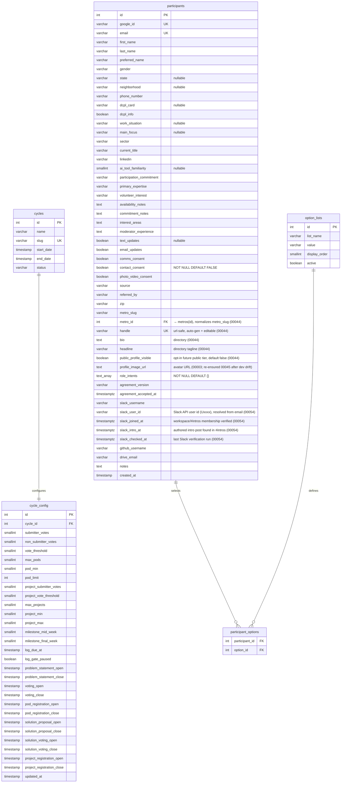
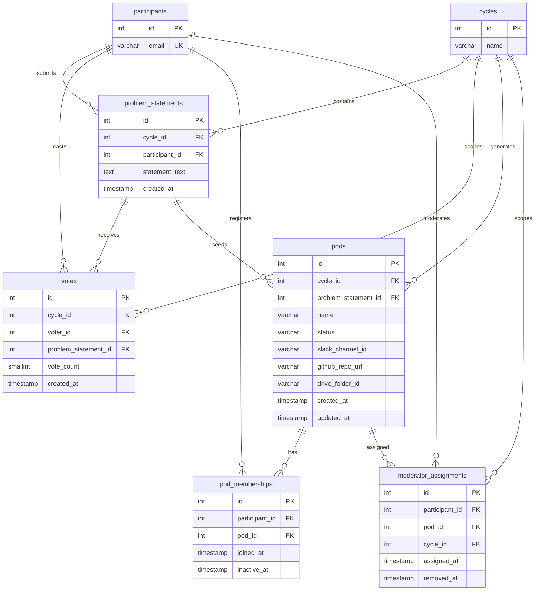
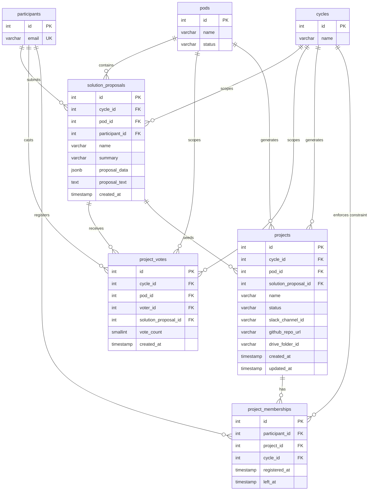
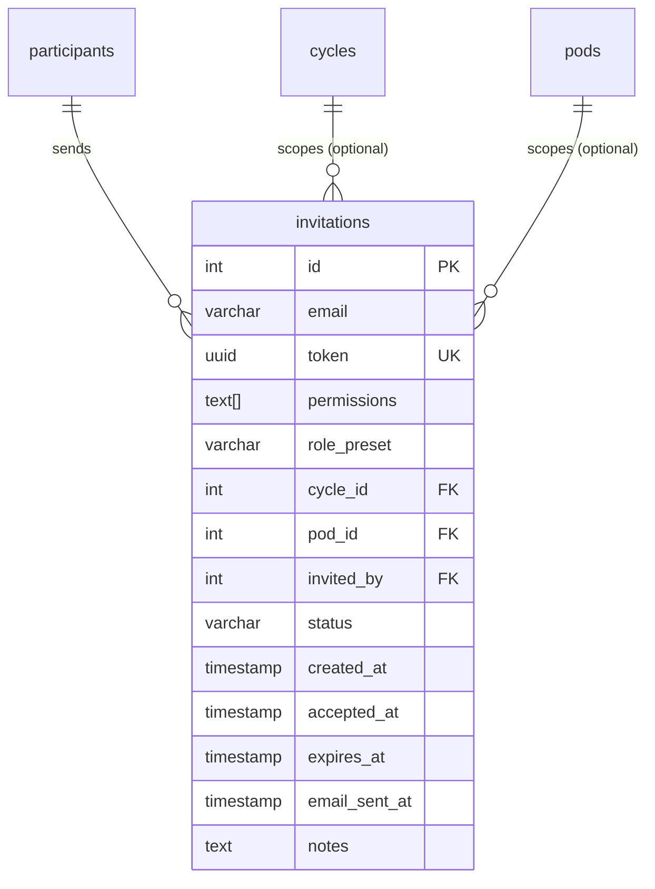
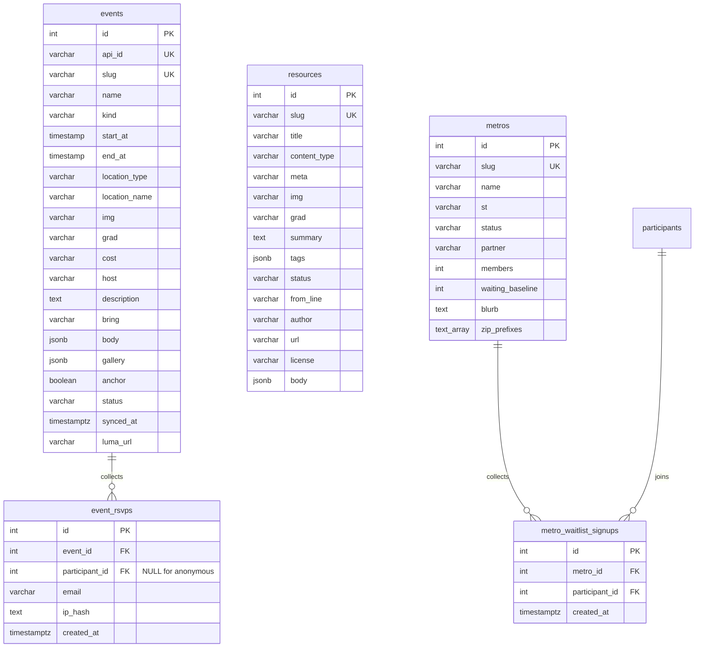
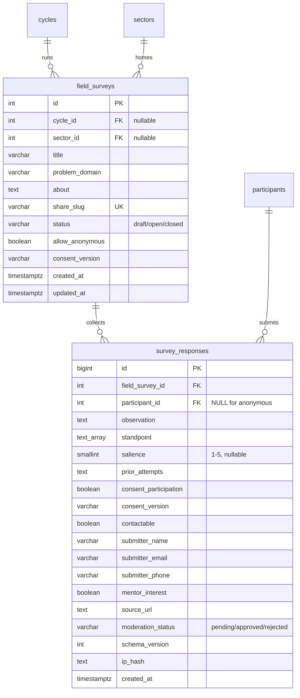

# OLOS Database Schema

Single PostgreSQL database. 19 tables (see the migration timeline for post-18 additions) organized around a **Cycle → Pod → Project** hierarchy.

---

## Lifecycle Overview

---

## ERD — Core & Configuration

`cycles` is the root of everything. `cycle_config` holds all tunable thresholds and window timestamps for a given cycle. `participants` is the system-wide identity table.

> `cycle_config.pod_limit` (migration `00043`, default 1) is the admin-editable ceiling on active pod memberships per participant per cycle — one pod by default. It replaces the old hardcoded 2-pod cap and is enforced in the pod register routes (participant + admin); projects stay at one-per-cycle, guaranteed by the `one_active_project_per_cycle` partial unique index.

> `cycle_config.milestone_mid_week` / `milestone_final_week` (migration `00047`, default 6 / 12) are the admin-editable cycle weeks the mid/end-cycle milestone Learning Logs open on. They drive `learning_logs.kind` = `milestone_7` / `milestone_13` (opaque legacy IDs from the old 13-week model, surfaced in the UI as "Mid-cycle" / "End-cycle"); the API server-derives which `kind` to write from the current cycle week against these values, else `weekly`. `log_due_at` / `log_gate_paused` (migration `00040`) are the weekly-gate stamp + grace toggle.

> **At most one `active` cycle at a time** — the `one_active_cycle` partial unique index (migration `00048`) enforces the house invariant every `.eq('status','active').maybeSingle()` read assumes (home, funnel, learning-log gate). The two cycle-activation paths (`/api/cycles/[id]/status`, `/api/cycles/[id]/advance-phase`) return a clear 409 instead of a raw unique-violation.

> **Sector model — Phase A (migration `00049`, `docs/SECTOR_MODEL.md`).** `sectors` is the durable, cross-cohort home for a theme's projects + field research (public commons; `status` active/dormant). A cycle is a *run under a sector*: `cycles.sector_id` FK + `cycles.mode` (`open`/`closed`). The lifecycle extends to **draft → upcoming → active → closing → archived** (`closed` kept as a legacy terminal), with a sibling `one_upcoming_cycle` partial unique index (≤1 `upcoming`). `cycle_enrollments.tier` (`member`/`contributor`) is the cohort authority tier; `projects.sector_id` + `projects.governance` (`cycle`→`sector` at graduation) give a project its durable home. Reads split via `lib/cycle/active.ts`: `getOperatingCycle()` (the `active` cohort) vs `getRecruitingCycle()` (the `upcoming` cohort, else active). Phases B–D (windows/tiers UI, graduation, living sector) are still design-only.

---

## ERD — Enrollment, Roles & Audit

Participants join cycles via `cycle_enrollments`. Elevated permissions are stored in `user_roles`. `access_revocations` is the audit trail for removals. `pulse_checks` tracks weekly engagement.

---

## ERD — Pod Layer (Phases 2–4)

Problem statements are submitted and voted on. Top statements become pods. Participants self-register into pods. Moderators are assigned per pod per cycle.

---

## ERD — Project Layer (Phases 5–7)

Mirrors the pod layer one level down. Solution proposals are submitted within pods, voted on, and top proposals become projects. Participants self-register into projects (max 1 active project per cycle).

---

## ERD — Invitations

Admins send magic link invitations to prospective participants via a CSV bulk upload flow. Each sent invite is one row. Resends create a new row; the original is left intact.

**Status values:** `pending` (sent, not yet accepted) · `accepted` (invitee logged in) · `expired` (link expired) · `revoked` (admin cancelled)

**`email_sent_at`:** Timestamp of the last time the magic link email was sent via Resend. `NULL` means the link was created but only shared via copy-paste, never emailed.

**Bulk invite flow:** `cycle_id`, `pod_id`, `permissions`, and `role_preset` are NULL/empty. `notes` carries per-row messaging back to the admin (e.g. "Name not found in participants", "Already logged in").

---

## ERD — Public Content (the CMS)

The public web's content tables (migration `00033_public_content.sql`), ported 1:1 from the onboarding-proto content directories (`events/ library/ labs/` data.js files — HANDOFF.md §4). These serve the public landing and the `/events/[slug]`, `/library/[slug]`, `/local-labs/[slug]` pages. Rows are seeded and refreshed idempotently by `00034_seed_public_content.sql` (slug-keyed upserts); edit content in the prototype's data.js first, then re-generate the seed.

**`events.start_at` / `end_at`:** plain `TIMESTAMP` holding local wall time, rendered as written — the prototype's Luma-shaped date strings. `anchor = TRUE` marks the cycle's six anchor events (✦ in the UI). `location_type`: `in_person` · `virtual`.

**Luma sync (migration `00035`, `lib/integrations/luma.ts`):** Luma is the source of truth for ALL events. The scheduled sync (`/api/cron/sync-luma-events`, every 6h in production; manual trigger `POST /api/admin/events/sync` for admins) upserts by `api_id`, overwriting only Luma-owned fields (name, times, location, cover `img`, `luma_url`, initial `description`) — local annotations (`slug`, `kind`, `anchor`, `grad`, `cost`, `host`, `bring`, `body`, `gallery`) are never touched. `synced_at` set = Luma-managed row. Reconciliation archives published *future* rows missing from a successful fetch (cancelled/unlisted on Luma); past rows are kept as history.

**Registration parity:** `event_rsvps` is a two-way mirror of Luma's guest list. Signed-in members one-tap register in-app (session identity, never client-supplied) and are forwarded to Luma's guest list with name + email — legitimate without Luma's registration questions because the Participant Agreement (photo clause included) was signed at signup. Anonymous visitors on Luma-managed events register on Luma's own page (its questions, photo release included); the email-only endpoint path remains for editorial (non-Luma) events. The sync additionally pulls each upcoming event's Luma guest list into `event_rsvps` (additive upserts — never deletes), so Luma-side registrations show as "You're going" in-app.

**`resources.content_type`:** `guide` · `recording` · `template` · `course` · `playbook`. `from_line` carries commons provenance ("BenefitsBot · Spring 2026 Cycle") — rendered as the "From the commons" band.

**`metros.status`:** two states only (owner decision) — `active` (DC) or `waitlist`. The rendered waiting count is `waiting_baseline + COUNT(metro_waitlist_signups)`.

**Metro assignment (migration `00038`):** `metros.zip_prefixes` (3-digit zip prefixes) is the zip→lab mapping as data; `lib/metros.ts metroFromZip()` resolves against it (unmatched zips fall back to the active lab), and `participants.metro_slug` carries a real FK to `metros(slug)` (`NOT VALID` — legacy rows validated as a follow-up). The old hardcoded TS map is retired.

**RSVP hardening (migration `00039`):** `event_rsvps.ip_hash` (sha256, never the raw IP) backs the anonymous path's per-IP window cap in `POST /api/events/[event_id]/rsvp` (`lib/api/rate-limit.ts` — the backend doc §8 pre-launch blocker); `participant_id` records member identity on the one-tap path (NULL for anonymous), feeding the Poderator workshop-signups view.

**Learning Log (migrations `00040`, `00041` — roadmap Phase 1):** `learning_logs` is the weekly practice ritual replacing `pulse_checks` for new cycles (pulse history stays, private, untouched). Three parts in one row: health check (`clarity`/`alignment` 1–5 + `is_blocked`/`blocker_context` — visible to the member, their Poderator, and admins; never shared), scaffolded reflection (`accomplished`/`exploring`/`next_focus`), and `share_publicly` — when true the API writes a `profile_updates` row carrying ONLY the concatenated paragraph (provenance via `learning_log_id`; the metrics never travel). `kind` carries the milestone variants (`milestone_7` / `milestone_13`, surfaced as Mid-cycle / End-cycle) — opened on the admin-configurable `cycle_config.milestone_mid_week` / `milestone_final_week` (migration `00047`, default weeks 6 / 12), server-derived at write time. No per-window unique — unlimited logs. The weekly gate is config-as-data: the Friday cron (`/api/cron/learning-log-window`) stamps `cycle_config.log_due_at`; an active enrollee with no log at/after the stamp is locked to the dashboard (`lib/learning-logs/gate.ts`); `log_gate_paused` is the grace toggle. RLS: self + cycle-staff SELECT, self INSERT, append-only; `profile_updates` is authenticated-SELECT (`visibility='labs'`), self-DELETE, service-role INSERT only. `participants.is_staff`/`is_test` (00041) are roster-visibility flags (hidden by default on Poderator rosters, excluded from health math) — never permissions.

**Upskiller Spotlights (migration `00051`):** `spotlights` is the public `/stories` page (onboarding-proto's `stories.html`) plus its submission pipeline, in one table. A "Share your story" submission (public `POST /api/stories`, per-IP throttled) lands as a row with `status='submitted'` and only `name` + `story` filled; the Labs team enriches the editorial fields (`role`, `tag`, `tag_label`, `quote`, `grad`) and flips `status='published'` from `/admin/stories` (`PATCH /api/admin/stories/[id]`, which stamps `published_at` and derives a unique `slug` — the `#s-{slug}` deep-link contract). RLS is anon-SELECT-`published`-only (mirrors events/resources); every write is service-role. Launches empty — no auto-publish (owner decision, concierge review), the same empty-until-real posture the Library took in `00036`. `image_url` (migration `00052`) is an optional member headshot (a `/assets/...` static path or an absolute URL); when NULL the `/stories` card + landing story row fall back to the orb placeholder — the same image-or-orb pattern the content teasers use for events/resources.

**Saved items (migration `00050`):** `saved_items` is a member's hearted content — the "Saved" vertical on the authed `/learning` page (onboarding-proto's `userState.saved`). Polymorphic by slug: `(item_type ∈ {event, resource}, slug)` points at the stable, URL-matching slug (events + resources are seeded idempotently by slug — 00033/00034), so a saved row survives a re-seed and maps 1:1 to `/events/{slug}` · `/library/{slug}`. `UNIQUE(participant_id, item_type, slug)`. The toggle route `POST /api/saved` (session identity, service-role) validates the slug against a *published* item before saving. RLS is self-only for SELECT/INSERT/DELETE (`participant_id = current_participant_id()`).

**Testing pathway (migration `00042`):** `testers` is the email-keyed tester grant (service-role only). Admin grants from `/admin/participants` (sets `participants.is_test` + the `testers` row); a tester self-resets via `POST /api/testing/reset` — every journey row AND the participants row deleted, so the next sign-in replays the full onboarding; the funnel re-applies `is_test` from the surviving email grant. The one sanctioned bulk-delete path in the app; proposals/statements that won (FK'd by projects/pods) survive a reset.

**Hardening batch (migration `00037`):** CHECK constraints (`NOT VALID`) on the four core lifecycle status columns — `cycles` (`draft/active/closed`), `pods` + `projects` (`forming/active/inactive`), `cycle_enrollments` (`inactive/active/revoked/stepped_back` — the last reserved for the leaving-well flow); a `set_updated_at()` trigger owns every `updated_at` column (routes no longer hand-set it); `search_path` pinned on the SECURITY DEFINER helpers + `can_write_cycles()` as the honest alias for `is_admin_or_owner()`; missing indexes on `votes(voter_id)`, `project_votes(voter_id / solution_proposal_id)`, `moderator_assignments(cycle_id)`, `events(status / start_at)`, `pulse_checks(participant_id, scheduled_date)`.

**RLS:** `events`/`resources` allow anon SELECT of `status = 'published'` rows; `metros` allows anon SELECT unconditionally (the public city search). `metro_waitlist_signups` is self-read only; `event_rsvps` has no public read. All writes go through service-role API routes — `POST /api/metros/[metro_id]/waitlist` (authed) and `POST /api/events/[event_id]/rsvp` (public, email-only by owner rule).

---

## ERD — Data Sensemaker (field survey → Ortelius groundwork)

The intake bedrock of the Data Sensemaker (`docs/SENSEMAKING_FLOW.md` §3, `docs/ORTELIUS_KNOWLEDGE_GRAPH.md` §3a) — the public, account-free field survey that replaces the Civics & Elections Google Form and seeds the first Ortelius provenance node. Gate-free (a form + storage, no in-app LLM). The AI-assisted extraction, canvas, and `asset_links`/`content_embeddings` graph build additively on top; the envelope columns here land day one so nothing at this leaf is ever migrated.

**`field_surveys` / `survey_responses` (migration `00053`):** the field-survey intake (`docs/SENSEMAKING_FLOW.md` §3). `field_surveys` is the instrument — one row per sector/cycle problem domain, seeded idempotently for Civics & Elections (`share_slug='civics'`, `status='open'`). The public page `/survey/[slug]` renders it (the survey-specific `about` lede from the row; the "what is the Labs / where do insights go" copy is boilerplate in the page). `survey_responses` is the observation bedrock: `observation` is the required evidence body every future `extract` derives from; `standpoint[]` feeds the coverage/diversity signal (never a credibility weight — `ORTELIUS_NORTHSTAR.md` §6); `salience`, `prior_attempts` (archaeology), and the contact fields are optional. Two distinct consents: `consent_participation` (required, gates submit) and `contactable` (optional). The **nullable `participant_id`** is the load-bearing anonymous public path; `mentor_interest` is a recruiting side-channel. **Ortelius groundwork columns land day one:** `source_url` (the evidence-producer gap, `ORTELIUS §5` gap #6), `consent_version`, `moderation_status`, and `schema_version` (gap #12 — versioned from day one). Every response is retained; curation is a later temporal overlay, never a delete (owner decision 2026-07-05). RLS: `field_surveys` anon-SELECT-`open`-only (mirrors spotlights/events); `survey_responses` has **no public policy** — all writes go through the service-role `POST /api/surveys/[slug]/responses` (member session binds `participant_id`; anonymous path is per-IP throttled via `lib/api/rate-limit.ts`, `moderation_status='pending'`), and reads stay service-role until a consented atlas surface ships.

---

## Table Summary

| Table | Group | Purpose |
|---|---|---|
| `cycles` | Core | Root entity; a single build cohort |
| `cycle_config` | Core | All tunable thresholds & window timestamps |
| `participants` | Core | System-wide identity & profile |
| `option_lists` | Core | Seed data for multiselect fields |
| `participant_options` | Core | Junction: participant ↔ multiselect choices |
| `cycle_enrollments` | Enrollment | Participant ↔ cycle membership + status |
| `user_roles` | Roles | Elevated roles (owner, admin, observer) |
| `moderator_assignments` | Roles | Pod-scoped moderator grants per cycle |
| `access_revocations` | Audit | Log of revocations with scope & reason |
| `pulse_checks` | Engagement | Weekly check-in responses (flexible JSONB) |
| `problem_statements` | Pod Layer | Submitted problems, one per participant per cycle |
| `votes` | Pod Layer | Budget-based votes on problem statements |
| `pods` | Pod Layer | Shortlisted problems with external integrations |
| `pod_memberships` | Pod Layer | Self-registration into pods (soft delete) |
| `solution_proposals` | Project Layer | Solutions submitted within pods. Rich payload via `name` + `summary` columns + `proposal_data` JSONB. `UNIQUE(cycle_id, participant_id)` enforces one submission per participant per cycle (migration 00016, W2-001). |
| `project_votes` | Project Layer | Budget-based votes on solution proposals |
| `projects` | Project Layer | Shortlisted solutions with external integrations |
| `project_memberships` | Project Layer | Self-registration into projects (1 active/cycle) |
| `invitations` | Invitations | Magic link invites sent by admins; one row per send |
| `events` | Public Content | Public events/workshops (Luma-shaped cache; the source until live sync) |
| `resources` | Public Content | Learning Library items (guides, recordings, templates, courses, playbooks) |
| `metros` | Public Content | Local labs / cities — `active` or `waitlist` |
| `metro_waitlist_signups` | Public Content | Participant ↔ metro waitlist joins (unique pair) |
| `event_rsvps` | Public Content | Email-only public RSVPs (never account-gated) |
| `learning_logs` | Practice | The weekly ritual: health check + reflection + share flag (replaces pulse_checks for new cycles) |
| `profile_updates` | Practice | Member updates feed — written ONLY by Learning Log shares |
| `saved_items` | Practice | A member's saved events/resources (the /learning hearts) — polymorphic by slug |
| `spotlights` | Public Content | Upskiller Spotlights + their submission pipeline (public /stories) |
| `field_surveys` | Data Sensemaker | The field-survey instrument — one row per sector/cycle problem domain (public `/survey/[slug]`) |
| `survey_responses` | Data Sensemaker | Field observations — the evidence bedrock; anon-capable, the first Ortelius provenance node |
| `testers` | Testing | Email-keyed tester grant — survives the tester's full self-reset |
