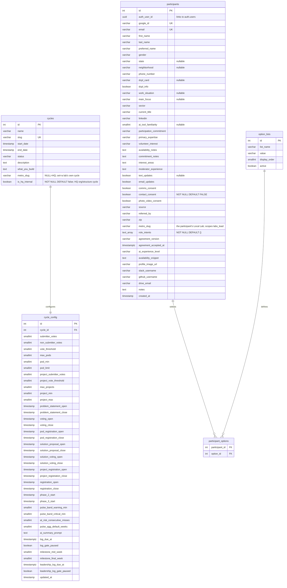
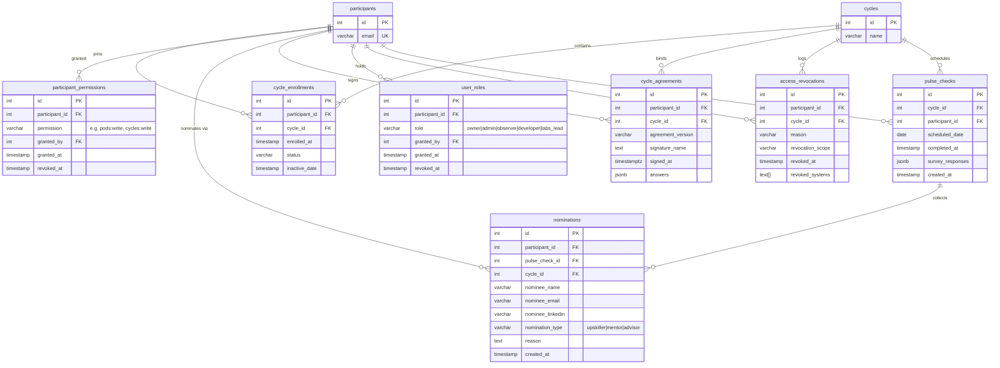
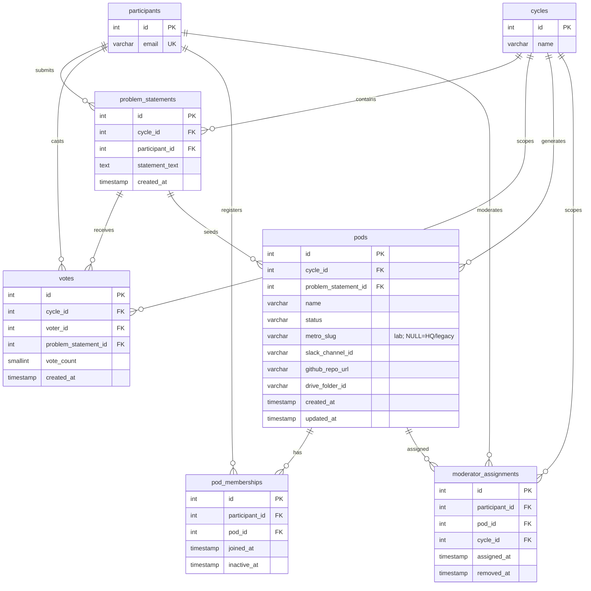
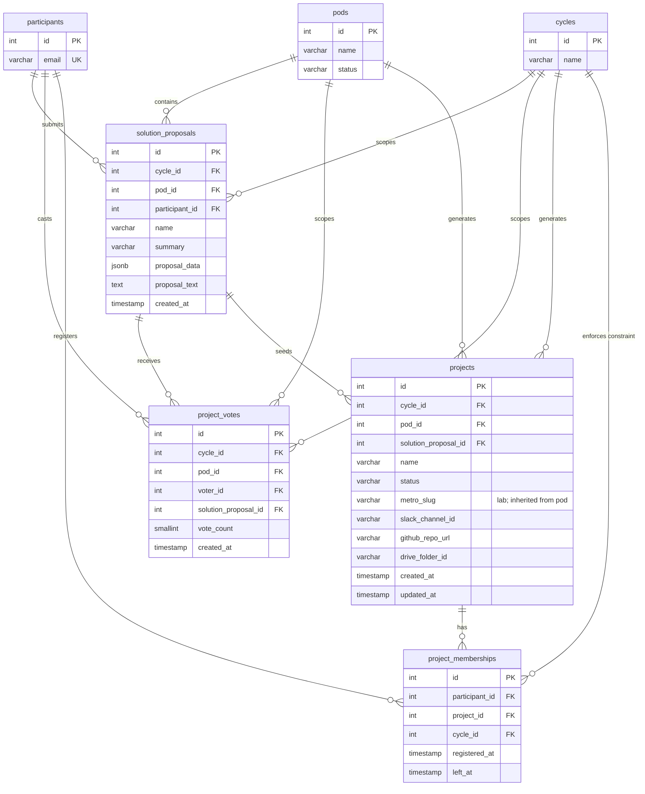
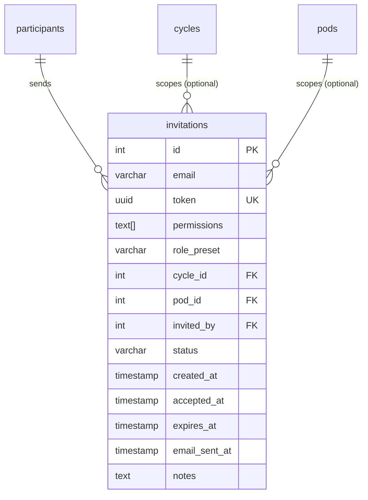

# OLOS Database Schema

Single PostgreSQL database. **26 tables owned by this repo's migration chain**
(`supabase/migrations/`, through `00039`), organized around a
**Cycle → Pod → Project** hierarchy.

> **Scope note:** the live dev database carries additional tables and
> `participants` columns provisioned *outside* this repo's chain (e.g.
> `metros`, `lab_leads`, `events`, `spotlights`, profile/social columns).
> This document covers only what the repo's migrations own; treat anything
> else you meet in the DB as externally managed.

---

## Lifecycle Overview

> **Per-lab formation (migrations `00038`/`00039`):** in an **HQ-open** cycle
> (`cycles.metro_slug IS NULL`, not `is_hq_internal`) this whole pipeline runs
> **once per Local Lab**: participants see and vote on only their own lab's
> problem statements, and finalization forms pods per lab, stamping
> `pods.metro_slug` (projects inherit it from their pod). A cycle with
> `metro_slug` set is a single lab's own cycle; `is_hq_internal = true` marks
> an HQ org-structure cycle (standing teams as "pods") hidden from labs leads.
> Enforcement lives in `lib/auth/cycle-access.ts`.

---

## ERD — Core & Configuration

`cycles` is the root of everything. `cycle_config` holds all tunable thresholds and window timestamps for a given cycle. `participants` is the system-wide identity table.

---

## ERD — Enrollment, Roles & Audit

Participants join cycles via `cycle_enrollments`. **Authorization's source of
truth is `participant_permissions`** — granular grants (`pods:write`,
`cycles:write`, …) that `can()` checks on every request; role presets
(`owner`, `admin`, `developer`, `labs_lead`, `observer`) expand into these
rows at invite time. `user_roles` is the **audit/identity row** for elevated
roles, not the permission store. `access_revocations` is the audit trail for
removals. `pulse_checks` tracks weekly engagement; `nominations` captures the
people participants nominate from inside a pulse check (third-party PII:
name, email, LinkedIn).

---

## ERD — Pod Layer (Phases 2–4)

Problem statements are submitted and voted on. Top statements become pods. Participants self-register into pods. Moderators are assigned per pod per cycle.

---

## ERD — Project Layer (Phases 5–7)

Mirrors the pod layer one level down. Solution proposals are submitted within pods, voted on, and top proposals become projects. Participants self-register into projects (max 1 active project per cycle).

---

## ERD — Invitations

Admins send magic link invitations to prospective participants via a CSV bulk upload flow. Each sent invite is one row. Resends create a new row; the original is left intact.

**Status values:** `pending` (sent, not yet accepted) · `accepted` (invitee logged in) · `expired` (link expired) · `revoked` (admin cancelled)

**`email_sent_at`:** Timestamp of the last time the magic link email was sent via Resend. `NULL` means the link was created but only shared via copy-paste, never emailed.

**Bulk invite flow:** `cycle_id`, `pod_id`, `permissions`, and `role_preset` are NULL/empty. `notes` carries per-row messaging back to the admin (e.g. "Name not found in participants", "Already logged in").

---

## Table Summary

| Table | Group | Purpose |
|---|---|---|
| `cycles` | Core | Root entity; a single build cohort |
| `cycle_config` | Core | All tunable thresholds & window timestamps |
| `participants` | Core | System-wide identity & profile |
| `option_lists` | Core | Seed data for multiselect fields |
| `participant_options` | Core | Junction: participant ↔ multiselect choices |
| `cycle_enrollments` | Enrollment | Participant ↔ cycle membership + status |
| `cycle_agreements` | Enrollment | Open Cycle Agreement signatures (typed name + answers) |
| `participant_permissions` | Roles | **Authorization source of truth** — granular grants checked by `can()` |
| `user_roles` | Roles | Audit/identity rows for elevated roles (owner, admin, observer, developer, labs_lead) — not the permission store |
| `moderator_assignments` | Roles | Pod-scoped moderator grants per cycle |
| `access_revocations` | Audit | Log of revocations with scope & reason |
| `pulse_checks` | Engagement | Weekly check-in responses (flexible JSONB) |
| `nominations` | Engagement | Third-party nominees captured from pulse checks (name, email, LinkedIn, type, reason) |
| `problem_statements` | Pod Layer | Submitted problems, one per participant per cycle |
| `votes` | Pod Layer | Budget-based votes on problem statements (lab-partitioned in HQ-open cycles) |
| `pods` | Pod Layer | Shortlisted problems with external integrations; `metro_slug` = the owning Local Lab (NULL = HQ/legacy) |
| `pod_memberships` | Pod Layer | Self-registration into pods (soft delete) |
| `solution_proposals` | Project Layer | Solutions submitted within pods. Rich payload via `name` + `summary` columns + `proposal_data` JSONB. `UNIQUE(cycle_id, participant_id)` enforces one submission per participant per cycle (migration 00016, W2-001). |
| `project_votes` | Project Layer | Budget-based votes on solution proposals |
| `projects` | Project Layer | Shortlisted solutions with external integrations; `metro_slug` inherited from the pod |
| `project_memberships` | Project Layer | Self-registration into projects (1 active/cycle) |
| `invitations` | Invitations | Magic link invites sent by admins; one row per send |
| `moderator_ui_state` | Moderator | Per-moderator dashboard UI state (poderator dashboard) |
| `nudge_dismissals` | Moderator | Dismissed at-risk nudges on the poderator dashboard |
| `feedback` | Feedback | In-app feedback widget submissions |
| `feedback_attachments` | Feedback | Image attachments on feedback submissions |
