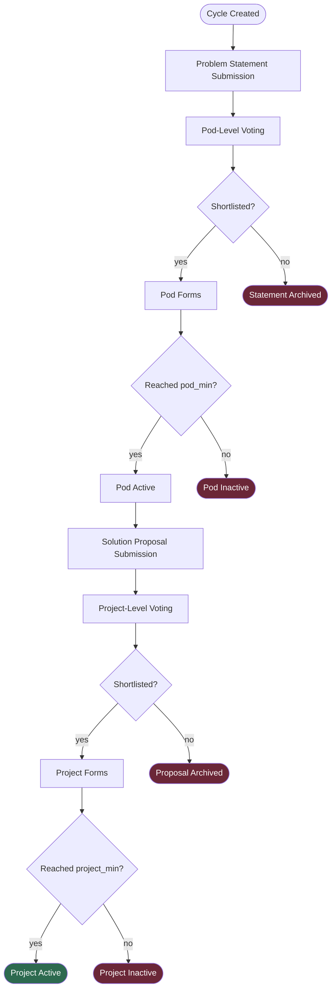
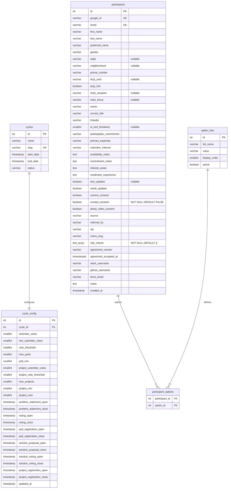
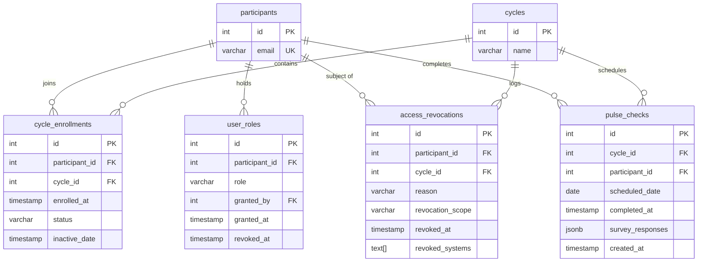
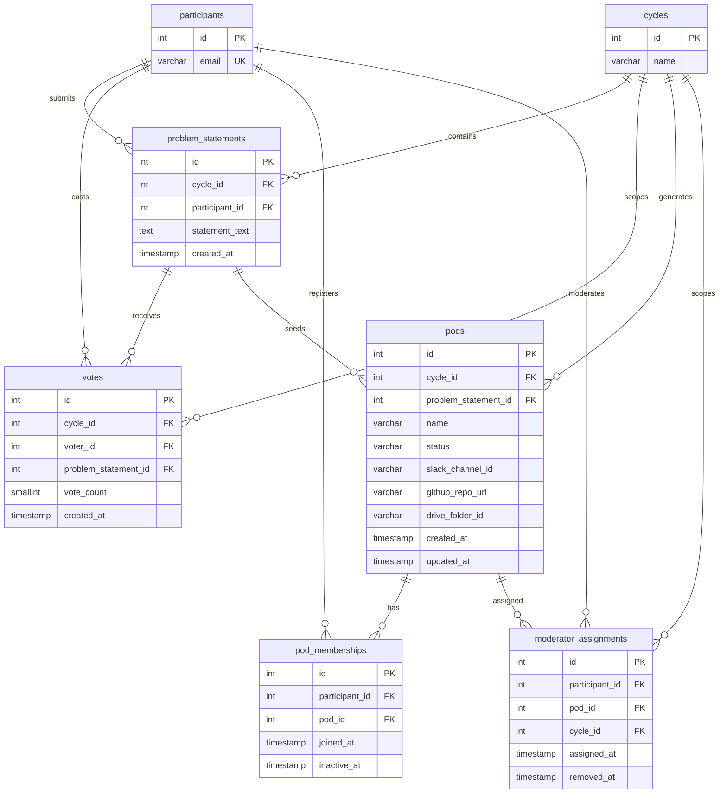
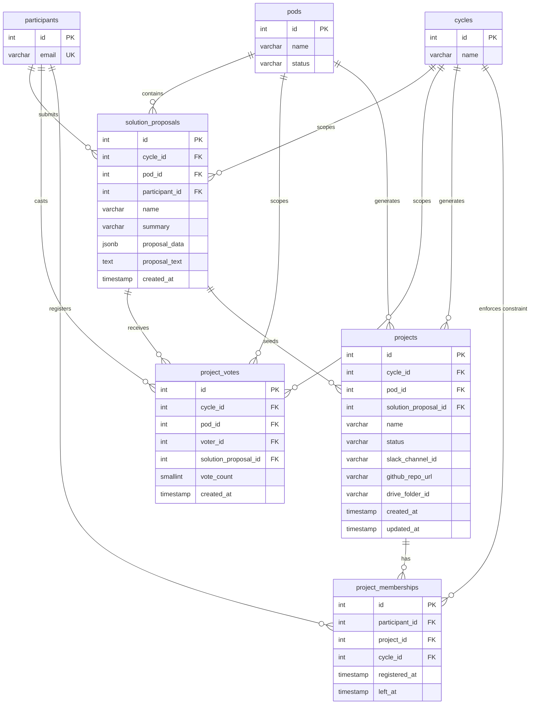
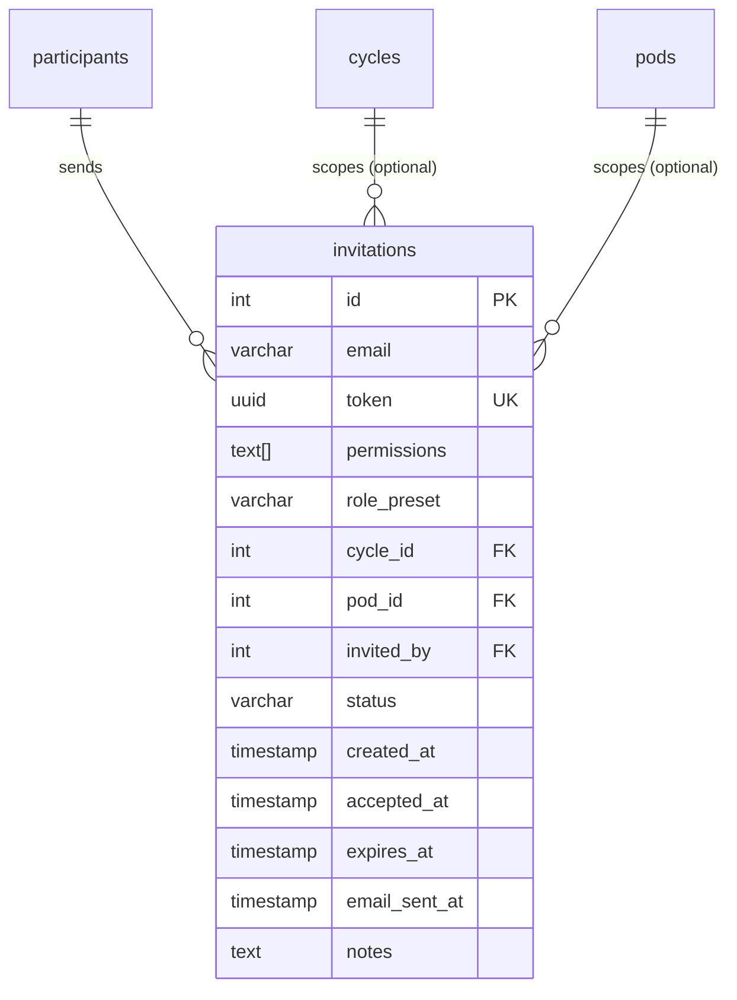

# OLOS Database Schema

Single PostgreSQL database. 18 tables organized around a **Cycle → Pod → Project** hierarchy.

---

## Lifecycle Overview

---

## ERD — Core & Configuration

`cycles` is the root of everything. `cycle_config` holds all tunable thresholds and window timestamps for a given cycle. `participants` is the system-wide identity table.

---

## ERD — Enrollment, Roles & Audit

Participants join cycles via `cycle_enrollments`. Elevated permissions are stored in `user_roles`. `access_revocations` is the audit trail for removals. `pulse_checks` tracks weekly engagement.

---

## ERD — Pod Layer (Phases 2–4)

Problem statements are submitted and voted on. Top statements become pods. Participants self-register into pods. Moderators are assigned per pod per cycle.

---

## ERD — Project Layer (Phases 5–7)

Mirrors the pod layer one level down. Solution proposals are submitted within pods, voted on, and top proposals become projects. Participants self-register into projects (max 1 active project per cycle).

---

## ERD — Invitations

Admins send magic link invitations to prospective participants via a CSV bulk upload flow. Each sent invite is one row. Resends create a new row; the original is left intact.

**Status values:** `pending` (sent, not yet accepted) · `accepted` (invitee logged in) · `expired` (link expired) · `revoked` (admin cancelled)

**`email_sent_at`:** Timestamp of the last time the magic link email was sent via Resend. `NULL` means the link was created but only shared via copy-paste, never emailed.

**Bulk invite flow:** `cycle_id`, `pod_id`, `permissions`, and `role_preset` are NULL/empty. `notes` carries per-row messaging back to the admin (e.g. "Name not found in participants", "Already logged in").

---

## Table Summary

| Table | Group | Purpose |
|---|---|---|
| `cycles` | Core | Root entity; a single build cohort |
| `cycle_config` | Core | All tunable thresholds & window timestamps |
| `participants` | Core | System-wide identity & profile |
| `option_lists` | Core | Seed data for multiselect fields |
| `participant_options` | Core | Junction: participant ↔ multiselect choices |
| `cycle_enrollments` | Enrollment | Participant ↔ cycle membership + status |
| `user_roles` | Roles | Elevated roles (owner, admin, observer) |
| `moderator_assignments` | Roles | Pod-scoped moderator grants per cycle |
| `access_revocations` | Audit | Log of revocations with scope & reason |
| `pulse_checks` | Engagement | Weekly check-in responses (flexible JSONB) |
| `problem_statements` | Pod Layer | Submitted problems, one per participant per cycle |
| `votes` | Pod Layer | Budget-based votes on problem statements |
| `pods` | Pod Layer | Shortlisted problems with external integrations |
| `pod_memberships` | Pod Layer | Self-registration into pods (soft delete) |
| `solution_proposals` | Project Layer | Solutions submitted within pods. Rich payload via `name` + `summary` columns + `proposal_data` JSONB. `UNIQUE(cycle_id, participant_id)` enforces one submission per participant per cycle (migration 00016, W2-001). |
| `project_votes` | Project Layer | Budget-based votes on solution proposals |
| `projects` | Project Layer | Shortlisted solutions with external integrations |
| `project_memberships` | Project Layer | Self-registration into projects (1 active/cycle) |
| `invitations` | Invitations | Magic link invites sent by admins; one row per send |
