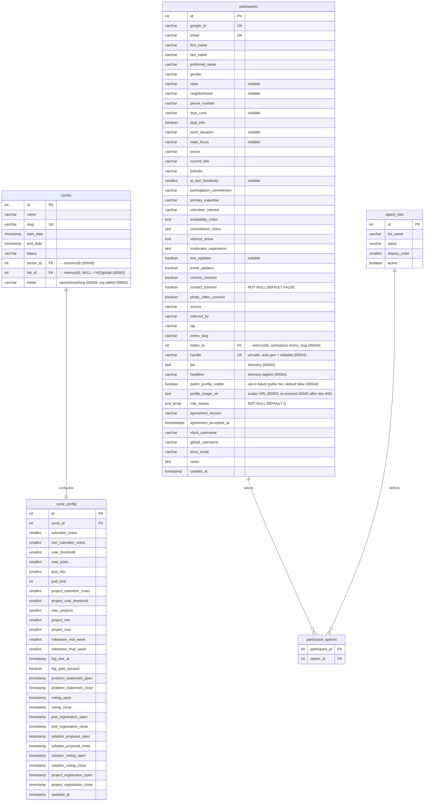
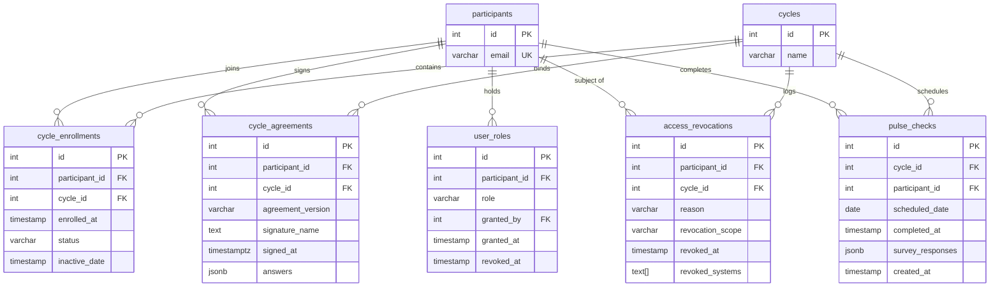
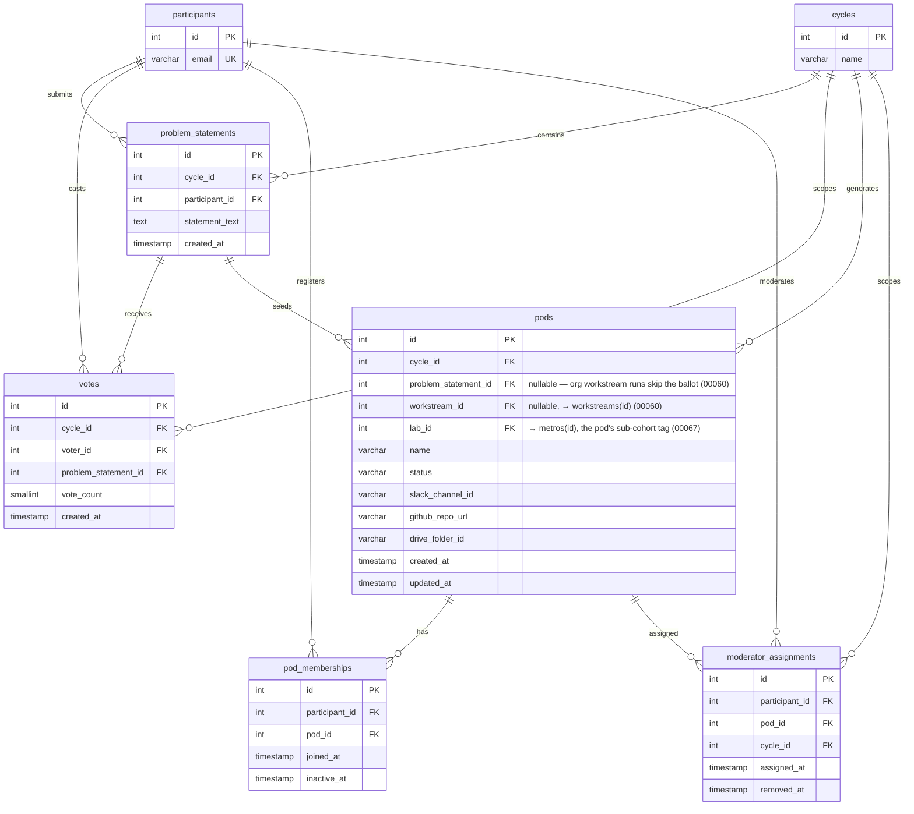
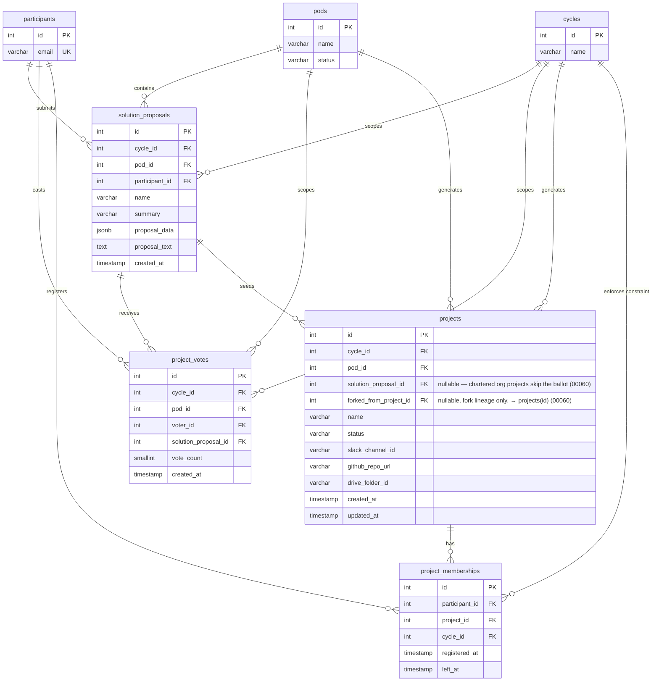
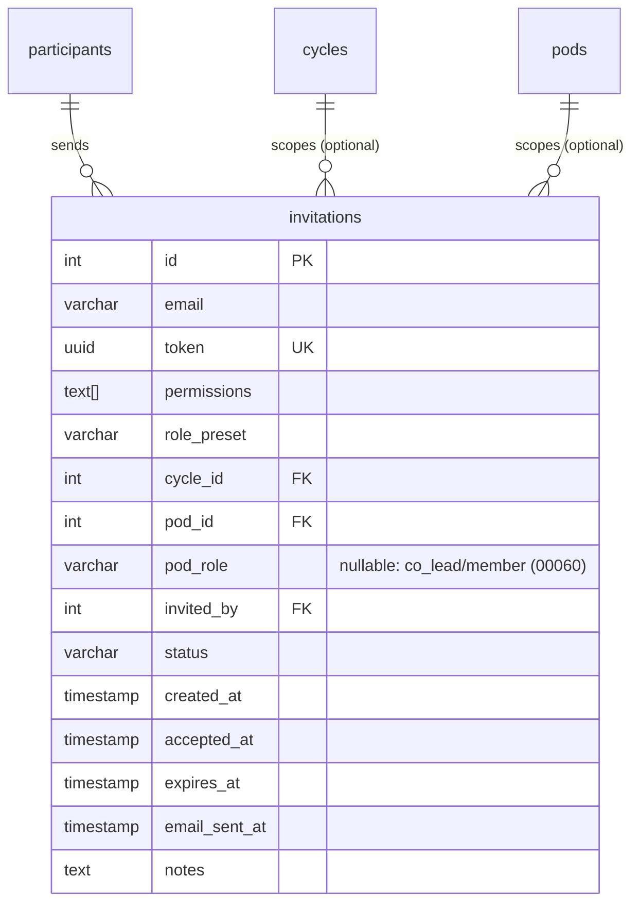
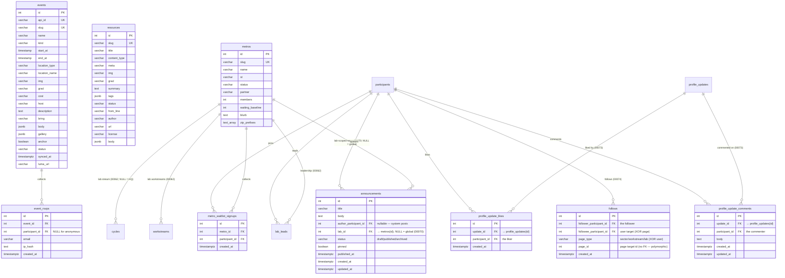
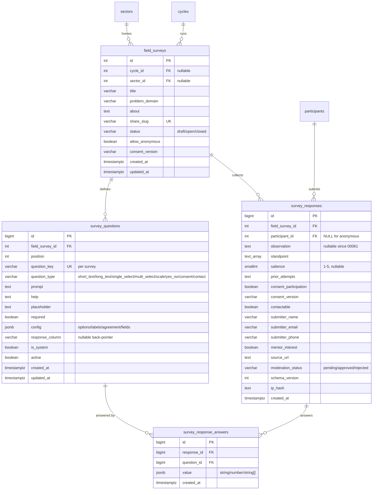
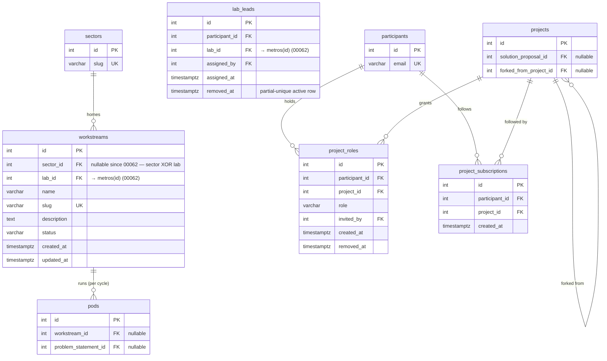

# OLOS Database Schema

Single PostgreSQL database. 19 tables (see the migration timeline for post-18 additions) organized around a **Cycle → Pod → Project** hierarchy.

---

## Lifecycle Overview

---

## ERD — Core & Configuration

`cycles` is the root of everything. `cycle_config` holds all tunable thresholds and window timestamps for a given cycle. `participants` is the system-wide identity table.

> `cycle_config.pod_limit` (migration `00043`, default 1) is the admin-editable ceiling on active pod memberships per participant per cycle — one pod by default. It replaces the old hardcoded 2-pod cap and is enforced in the pod register routes (participant + admin); projects stay at one-per-cycle, guaranteed by the `one_active_project_per_cycle` partial unique index.

> `cycle_config.milestone_mid_week` / `milestone_final_week` (migration `00047`, default 6 / 12) are the admin-editable cycle weeks the mid/end-cycle milestone Learning Logs open on. They drive `learning_logs.kind` = `milestone_7` / `milestone_13` (opaque legacy IDs from the old 13-week model, surfaced in the UI as "Mid-cycle" / "End-cycle"); the API server-derives which `kind` to write from the current cycle week against these values, else `weekly`. `log_due_at` / `log_gate_paused` (migration `00040`) are the weekly-gate stamp + grace toggle.

> **At most one `active` cycle per (mode, lab)** — originally a single global invariant (`one_active_cycle`, migration `00048`), rescoped per `cycles.mode` by migration `00060` once `mode='org'` landed, then per (mode, lab) by migration `00062` for Local Labs (`docs/LOCAL_LABS.md`): `one_active_cycle_per_mode_lab` / `one_upcoming_cycle_per_mode_lab` enforce ≤1 active + ≤1 upcoming per mode within each lab's stream (`COALESCE(lab_id, 0)` — HQ/global's NULL bucket keeps the old invariant verbatim), so the participant cycle, the org cycle, and each lab's own cycles can all legitimately be `status='active'` at once. `mode='closed'` (B2B) stays unconstrained — a deferred, possibly-parallel track (SECTOR_MODEL §10). Every `.eq('status','active').maybeSingle()` read must be mode- AND lab-aware as a result (route through `lib/cycle/active.ts`); the cycle-activation path (`/api/cycles/[id]/status`) returns a clear 409 instead of a raw unique-violation.

> **Sub-cohort rescope (migration `00067`).** The `mode='open'` participant track is now a SINGLE HQ stream: `one_active_open_cycle`/`one_upcoming_open_cycle` are global (no lab in the key) and the `cycles_open_is_hq_when_live` CHECK forbids a live open cycle with a `lab_id`. Labs participate as sub-cohorts inside the HQ open cycle via `pods.lab_id` + `participants.metro_id` — nothing per-lab to activate. `mode='org'` keeps the per-lab invariant (`one_active_org_cycle_per_lab`/`one_upcoming_org_cycle_per_lab`): labs still run their own internal team cycles.

> **Local Labs (migration `00062`, `docs/LOCAL_LABS.md`).** The `metros` table is the lab entity — promoted from content-only to organizational anchor. `cycles.lab_id` / `workstreams.lab_id` FK → `metros(id)`, NULL = HQ/global; workstreams live in exactly one home (`workstreams_one_home_check`: sector XOR lab — labs are orthogonal to sectors by owner constraint). `lab_leads` (participant_id, lab_id, removed_at; partial-unique active row) is lab-scoped leadership, the `moderator_assignments` pattern one tier up, surfaced as `UserRoles.labLeadLabIds`. `metros.is_default` names the zip-fallback lab. Pods carry their own `lab_id` sub-cohort tag as of `00067` — the single HQ `mode='open'` cycle means a pod's lab can no longer be derived via `cycle_id` (see the sub-cohort note below); projects derive their lab from their pod and still graduate to sectors (global) at cycle end.

> **Pods are local only (migration `00068`, `docs/LOCAL_LABS.md`).** `pods.lab_id` is now a membership FENCE, not just a host tag. A `BEFORE INSERT OR UPDATE` trigger on `pod_memberships` (`enforce_local_pod_membership`) requires `participants.metro_id = pods.lab_id` for an active membership in an **open-mode** cycle pod carrying a lab; it fires only on entry-into-active (fresh insert or reactivation of a soft-deleted row) so grandfathered rows, close-out, and reconciler reactivations never wedge, and it exempts org runs (invite-only, cross-lab) and NULL-lab/HQ pods. `problem_statements.metro_id` snapshots the submitter's lab at submission time so per-lab voting/formation is stable if a member later changes labs. Registration establishes lab membership explicitly (join active / join waitlist / start waitlist); `participants.metro_id` references only `active` labs, and active-lab membership is required to register for a cycle.

> **Sector model — Phase A (migration `00049`, `docs/SECTOR_MODEL.md`).** `sectors` is the durable, cross-cohort home for a theme's projects + field research (public commons; `status` active/dormant). A cycle is a *run under a sector*: `cycles.sector_id` FK + `cycles.mode` (`open`/`closed`/`org` — `org` added by migration `00060`, see below). The lifecycle extends to **draft → upcoming → active → closing → archived** (`closed` kept as a legacy terminal), with a sibling `one_upcoming_cycle` partial unique index (≤1 `upcoming`) — since rescoped per mode by `00060` (previous paragraph). `cycle_enrollments.tier` (`member`/`contributor`) is the cohort authority tier; `projects.sector_id` + `projects.governance` (`cycle`→`sector` at graduation) give a project its durable home. Reads split via `lib/cycle/active.ts`: `getOperatingCycle()` (the `active` cohort) vs `getRecruitingCycle()` (the `upcoming` cohort, else active). Phases B–D (windows/tiers UI, graduation, living sector) are still design-only.

> **Org cycles (migration `00060`, `docs/ORG_CYCLES.md`).** The org (HQ + Core Contributors) runs quarterly cycles on internal workstreams — `cycles.mode='org'`, dogfooding the participant cycle machinery instead of forking it — under a seeded `sectors` row (`slug='the-upskilling-labs-hq'`). `workstreams` is the durable, cross-cycle unit of internal work; each org cycle spins up a per-workstream "run", which is an ordinary `pods` row (`pods.workstream_id` FK, `problem_statement_id` now nullable — a run is chartered, not voted into existence from a ballot). Co-leads on a run are `moderator_assignments` + `pod_memberships`; core contributors are invite-only `pod_memberships` (`invitations.pod_role` — `co_lead` fulfills into `moderator_assignments` + `pod_memberships`, `member` into `pod_memberships` only; `NULL` = legacy poderator-only invite). Org *projects* are chartered by a run's co-leads rather than voted out of a `solution_proposals` ballot, so `projects.solution_proposal_id` is now nullable too; `projects.forked_from_project_id` is a fork-lineage pointer (no endpoint/UI yet). ICs join a project via `project_subscriptions` (self-serve follow) and, once promoted by a DRI, `project_roles` (`dri`/`contributor`) — the open-source-style ladder SECTOR_MODEL §5/§7 describes, reused for both org and participant projects.

---

## ERD — Enrollment, Roles & Audit

Participants join cycles via `cycle_enrollments`. Authority (owner/admin/developer/observer + scoped poderator/lab_lead) resolves from `participant_roles` — see the authorization note below. `access_revocations` is the audit trail for removals. `pulse_checks` tracks weekly engagement.

---

## ERD — Pod Layer (Phases 2–4)

Problem statements are submitted and voted on. Top statements become pods. Participants self-register into pods. Moderators are assigned per pod per cycle.

---

## ERD — Project Layer (Phases 5–7)

Mirrors the pod layer one level down. Solution proposals are submitted within pods, voted on, and top proposals become projects. Participants self-register into projects (max 1 active project per cycle).

---

## ERD — Invitations

Admins send magic link invitations to prospective participants via a CSV bulk upload flow. Each sent invite is one row. Resends create a new row; the original is left intact.

**Status values:** `pending` (sent, not yet accepted) · `accepted` (invitee logged in) · `expired` (link expired) · `revoked` (admin cancelled)

**`pod_role` (migration `00060`):** nullable — `NULL` is the legacy poderator-only fulfillment path; `co_lead` fulfills an accepted invite into `moderator_assignments` + `pod_memberships` on the target pod, `member` into `pod_memberships` only. Used for org workstream run invites (co-leads, core contributors).

**`email_sent_at`:** Timestamp of the last time the magic link email was sent via Resend. `NULL` means the link was created but only shared via copy-paste, never emailed.

**Bulk invite flow:** `cycle_id`, `pod_id`, `permissions`, and `role_preset` are NULL/empty. `notes` carries per-row messaging back to the admin (e.g. "Name not found in participants", "Already logged in").

---

## ERD — Public Content (the CMS)

The public web's content tables (migration `00033_public_content.sql`), ported 1:1 from the onboarding-proto content directories (`events/ library/ labs/` data.js files — HANDOFF.md §4). These serve the public landing and the `/events/[slug]`, `/library/[slug]`, `/local-labs/[slug]` pages. Rows are seeded and refreshed idempotently by `00034_seed_public_content.sql` (slug-keyed upserts); edit content in the prototype's data.js first, then re-generate the seed.

**`events.start_at` / `end_at`:** plain `TIMESTAMP` holding local wall time, rendered as written — the prototype's Luma-shaped date strings. `anchor = TRUE` marks the cycle's six anchor events (✦ in the UI). `location_type`: `in_person` · `virtual`.

**Luma sync (migration `00035`, `lib/integrations/luma.ts`):** Luma is the source of truth for ALL events. The scheduled sync (`/api/cron/sync-luma-events`, every 6h in production; manual trigger `POST /api/admin/events/sync` for admins) upserts by `api_id`, overwriting only Luma-owned fields (name, times, location, cover `img`, `luma_url`, initial `description`) — local annotations (`slug`, `kind`, `anchor`, `grad`, `cost`, `host`, `bring`, `body`, `gallery`) are never touched. `synced_at` set = Luma-managed row. Reconciliation archives published *future* rows missing from a successful fetch (cancelled/unlisted on Luma); past rows are kept as history.

**Registration parity:** `event_rsvps` is a two-way mirror of Luma's guest list. Signed-in members one-tap register in-app (session identity, never client-supplied) and are forwarded to Luma's guest list with name + email — legitimate without Luma's registration questions because the Participant Agreement (photo clause included) was signed at signup. Anonymous visitors on Luma-managed events register on Luma's own page (its questions, photo release included); the email-only endpoint path remains for editorial (non-Luma) events. The sync additionally pulls each upcoming event's Luma guest list into `event_rsvps` (additive upserts — never deletes), so Luma-side registrations show as "You're going" in-app.

**`resources.content_type`:** `guide` · `recording` · `template` · `course` · `playbook`. `from_line` carries commons provenance ("BenefitsBot · Spring 2026 Cycle") — rendered as the "From the commons" band.

**`metros.status`:** two states only (owner decision) — `active` (DC) or `waitlist`. The rendered waiting count is `waiting_baseline + COUNT(metro_waitlist_signups)`.

**Metro assignment (migration `00038`):** `metros.zip_prefixes` (3-digit zip prefixes) is the zip→lab mapping as data; `lib/metros.ts metroFromZip()` resolves against it (unmatched zips fall back to the active lab), and `participants.metro_slug` carries a real FK to `metros(slug)` (`NOT VALID` — legacy rows validated as a follow-up). The old hardcoded TS map is retired.

**RSVP hardening (migration `00039`):** `event_rsvps.ip_hash` (sha256, never the raw IP) backs the anonymous path's per-IP window cap in `POST /api/events/[event_id]/rsvp` (`lib/api/rate-limit.ts` — the backend doc §8 pre-launch blocker); `participant_id` records member identity on the one-tap path (NULL for anonymous), feeding the Poderator workshop-signups view.

**Learning Log (migrations `00040`, `00041` — roadmap Phase 1):** `learning_logs` is the weekly practice ritual replacing `pulse_checks` for new cycles (pulse history stays, private, untouched). Three parts in one row: health check (`clarity`/`alignment` 1–5 + `is_blocked`/`blocker_context` — visible to the member, their Poderator, and admins; never shared), scaffolded reflection (`accomplished`/`exploring`/`next_focus`), and `share_publicly` — when true the API writes a `profile_updates` row carrying ONLY the concatenated paragraph (provenance via `learning_log_id`; the metrics never travel). `kind` carries the milestone variants (`milestone_7` / `milestone_13`, surfaced as Mid-cycle / End-cycle) — opened on the admin-configurable `cycle_config.milestone_mid_week` / `milestone_final_week` (migration `00047`, default weeks 6 / 12), server-derived at write time. No per-window unique — unlimited logs. The weekly gate is config-as-data: the Friday cron (`/api/cron/learning-log-window`) stamps `cycle_config.log_due_at`; an active enrollee with no log at/after the stamp is locked to the dashboard (`lib/learning-logs/gate.ts`); `log_gate_paused` is the grace toggle. RLS: self + cycle-staff SELECT, self INSERT, append-only; `profile_updates` is authenticated-SELECT (`visibility='labs'`), self-DELETE, service-role INSERT only. `participants.is_staff`/`is_test` (00041) are roster-visibility flags (hidden by default on Poderator rosters, excluded from health math) — never permissions.

**Upskiller Spotlights (migration `00051`):** `spotlights` is the public `/stories` page (onboarding-proto's `stories.html`) plus its submission pipeline, in one table. A "Share your story" submission (public `POST /api/stories`, per-IP throttled) lands as a row with `status='submitted'` and only `name` + `story` filled; the Labs team enriches the editorial fields (`role`, `tag`, `tag_label`, `quote`, `grad`) and flips `status='published'` from `/admin/stories` (`PATCH /api/admin/stories/[id]`, which stamps `published_at` and derives a unique `slug` — the `#s-{slug}` deep-link contract). RLS is anon-SELECT-`published`-only (mirrors events/resources); every write is service-role. Launches empty — no auto-publish (owner decision, concierge review), the same empty-until-real posture the Library took in `00036`. `image_url` (migration `00052`) is an optional member headshot (a `/assets/...` static path or an absolute URL); when NULL the `/stories` card + landing story row fall back to the orb placeholder — the same image-or-orb pattern the content teasers use for events/resources.

**Org announcements (migration `00070`):** `announcements` is the admin-authored org-news feed in the participant dashboard's right rail — a first-class content table alongside `spotlights`/`events`. `lab_id` follows the `cycles`/`workstreams` scope model (00062): `NULL` = global/org-wide, set = one local lab (`metros`); a member sees published rows that are global OR match their own `metro_id`. Lifecycle is `draft`→`published`→`archived` with a `pinned` float; publishing stamps `published_at` (once set, kept). Authoring is `/admin/announcements` (admins, any audience) and the `/lab/[slug]` lab workspace (lab leads, scoped to their lab) — both hit `POST /api/admin/announcements` + `PATCH`/`DELETE /api/admin/announcements/[id]`, now `withAuth` + `requireLabAccess()` (not admin-only): an admin posts anything incl. org-wide, a lab lead only their own lab (`lab_id` NULL stays admin-only). `author_participant_id` is nullable for institutional posts. RLS: authenticated SELECT of `published` rows (admins see every status for the review surface); writes `is_admin_or_owner() OR (lab_id IS NOT NULL AND is_lab_lead(lab_id))` (`is_lab_lead` added in `00071`, mirrors `is_admin()` over `participant_roles`). `updated_at` owned by the shared `set_updated_at()` trigger (00037).

**Saved items (migration `00050`):** `saved_items` is a member's hearted content — the "Saved" vertical on the authed `/learning` page (onboarding-proto's `userState.saved`). Polymorphic by slug: `(item_type ∈ {event, resource}, slug)` points at the stable, URL-matching slug (events + resources are seeded idempotently by slug — 00033/00034), so a saved row survives a re-seed and maps 1:1 to `/events/{slug}` · `/library/{slug}`. `UNIQUE(participant_id, item_type, slug)`. The toggle route `POST /api/saved` (session identity, service-role) validates the slug against a *published* item before saving. RLS is self-only for SELECT/INSERT/DELETE (`participant_id = current_participant_id()`).

**Testing pathway (migration `00042`):** `testers` is the email-keyed tester grant (service-role only). Admin grants from `/admin/participants` (sets `participants.is_test` + the `testers` row); a tester self-resets via `POST /api/testing/reset` — every journey row AND the participants row deleted, so the next sign-in replays the full onboarding; the funnel re-applies `is_test` from the surviving email grant. The one sanctioned bulk-delete path in the app; proposals/statements that won (FK'd by projects/pods) survive a reset.

**Hardening batch (migration `00037`):** CHECK constraints (`NOT VALID`) on the four core lifecycle status columns — `cycles` (`draft/active/closed`), `pods` + `projects` (`forming/active/inactive`), `cycle_enrollments` (`inactive/active/revoked/stepped_back` — the last reserved for the leaving-well flow); a `set_updated_at()` trigger owns every `updated_at` column (routes no longer hand-set it); `search_path` pinned on the SECURITY DEFINER helpers + `can_write_cycles()` as the honest alias for `is_admin_or_owner()`; missing indexes on `votes(voter_id)`, `project_votes(voter_id / solution_proposal_id)`, `moderator_assignments(cycle_id)`, `events(status / start_at)`, `pulse_checks(participant_id, scheduled_date)`.

**RLS:** `events`/`resources` allow anon SELECT of `status = 'published'` rows; `metros` allows anon SELECT unconditionally (the public city search). `metro_waitlist_signups` is self-read only; `event_rsvps` has no public read. All writes go through service-role API routes — `POST /api/metros/[metro_id]/waitlist` (authed) and `POST /api/events/[event_id]/rsvp` (public, email-only by owner rule).

---

## ERD — Data Sensemaker (field survey → Ortelius groundwork)

The intake bedrock of the Data Sensemaker (`docs/SENSEMAKING_FLOW.md` §3, `docs/ORTELIUS_KNOWLEDGE_GRAPH.md` §3a) — the public, account-free field survey that replaces the Civics & Elections Google Form and seeds the first Ortelius provenance node. Gate-free (a form + storage, no in-app LLM). The AI-assisted extraction, canvas, and `asset_links`/`content_embeddings` graph build additively on top; the envelope columns here land day one so nothing at this leaf is ever migrated.

**`field_surveys` / `survey_responses` (migration `00053`):** the field-survey intake (`docs/SENSEMAKING_FLOW.md` §3). `field_surveys` is the instrument — one row per sector/cycle problem domain, seeded idempotently for Civics & Elections (`share_slug='civics'`, `status='open'`). The public page `/survey/[slug]` renders it (the survey-specific `about` lede from the row; the "what is the Labs / where do insights go" copy is boilerplate in the page). `survey_responses` is the observation bedrock: `observation` is the required evidence body every future `extract` derives from; `standpoint[]` feeds the coverage/diversity signal (never a credibility weight — `ORTELIUS_NORTHSTAR.md` §6); `salience`, `prior_attempts` (archaeology), and the contact fields are optional. Two distinct consents: `consent_participation` (required, gates submit) and `contactable` (optional). The **nullable `participant_id`** is the load-bearing anonymous public path; `mentor_interest` is a recruiting side-channel. **Ortelius groundwork columns land day one:** `source_url` (the evidence-producer gap, `ORTELIUS §5` gap #6), `consent_version`, `moderation_status`, and `schema_version` (gap #12 — versioned from day one). Every response is retained; curation is a later temporal overlay, never a delete (owner decision 2026-07-05). RLS: `field_surveys` anon-SELECT-`open`-only (mirrors spotlights/events); `survey_responses` has **no public policy** — all writes go through the service-role `POST /api/surveys/[slug]/responses` (member session binds `participant_id`; anonymous path is per-IP throttled via `lib/api/rate-limit.ts`, `moderation_status='pending'`), and reads stay service-role until a consented atlas surface ships.

**`survey_questions` / `survey_response_answers` (migration `00061`):** the question builder makes the instrument data-driven. `survey_questions` holds the ordered questions a cycle admin authors (`question_type`, `prompt`, per-type `config` JSONB — options, scale labels, consent agreement, contact fields); the public flow renders them via `questionsToFlowSteps` (`survey-flow.tsx`) instead of a hardcoded list, and the write route resolves answers against them. `survey_responses` stays the **submission envelope** (unchanged): a `response_column` back-pointer on a question routes its answer into the legacy typed column (`observation`, `standpoint`, `salience`, `mentor_interest`, `consent_participation`, and the contact fan-out to `submitter_*`), so the seeded Civics questions keep old rows valid and render identically — `observation` is now nullable (`00061`) only so a survey without an observation question can still insert. Custom (non-`response_column`) questions store one `survey_response_answers` row each (`value` JSONB). `is_system` questions (the seeded 7) are locked in the builder — type, `response_column`, and options can't change, and they can't be deleted — because downstream readers (CSV export, future Ortelius extraction of `observation`) and the coverage signal depend on them. RLS: `survey_questions` anon-SELECT only for an `open` survey; `survey_response_answers` service-role only (mirrors `survey_responses`). CSV export (`GET /api/surveys/[slug]/export`, admin + assigned poderator) pivots one column per question across both storage sources.

---

## ERD — Org Cycles & Workstreams

The org (HQ + Core Contributors) runs quarterly cycles on internal workstreams — `docs/ORG_CYCLES.md`, `docs/SECTOR_MODEL.md` §7/§10. `workstreams` is the durable, cross-cycle unit of work; a quarter's org cycle spins up a per-workstream "run" as an ordinary `pods` row (`workstream_id` FK). ICs join a project via a self-serve subscription, then a promoted role.

**`workstreams` (migration `00060`):** the durable, cross-cycle unit of internal org work (e.g. "Moderator tooling"), homed under the seeded `sectors` row `slug='the-upskilling-labs-hq'`. `status` `active`/`dormant` — only `active` workstreams get a run spun up when an org cycle starts. RLS: public SELECT (same posture as `sectors`); no write policies — service-role only.

**Workstream runs:** a run is not a new table — it's a `pods` row for the org cycle with `workstream_id` set. `one_run_per_workstream_per_cycle` (partial unique on `pods(workstream_id, cycle_id) WHERE workstream_id IS NOT NULL`) caps it at one run per workstream per cycle. `pods.problem_statement_id` is nullable as of `00060` because a run is chartered by the workstream, not voted into existence from a problem-statement ballot. Co-leads on a run are `moderator_assignments` + `pod_memberships`; core contributors are invite-only `pod_memberships` (see `invitations.pod_role` above).

**`project_roles` / `project_subscriptions` (migration `00060`):** the open-source-style IC ladder (SECTOR_MODEL §5/§7), shared by org and participant projects alike. A participant self-serve follows a project via `project_subscriptions` (`UNIQUE(participant_id, project_id)`); a DRI promotes a subscriber (or anyone) into an active `project_roles` row (`dri`/`contributor`, `invited_by` provenance). `one_active_project_role` caps a person to one *active* role per project at a time (`removed_at IS NULL`) — re-adding after removal is a new row, preserving history. `projects.solution_proposal_id` is nullable as of `00060` (chartered org projects skip the voting ballot); `projects.forked_from_project_id` is a fork-lineage pointer only, no endpoint/UI yet. RLS: `project_roles` is public SELECT (the ladder is public) with service-role-only writes (DRI check enforced in app code); `project_subscriptions` mirrors `saved_items` — self SELECT/INSERT/DELETE via `current_participant_id()`, plus staff SELECT via `can_write_cycles()`.

**Authorization unification (migrations `00064`–`00066`, 2026-07):** `participant_roles` (00054) becomes the single source of truth for the admin/owner determination, read by **both** the app (`resolveUserRoles`) and DB RLS (`is_admin()`/`is_owner()`, 00058) — closing the split-brain where post-00054 grants landed only in `user_roles`/`participant_permissions` and were invisible to RLS + the owner-only `delete_participant`/`change_participant_email` functions. `00064` adds `lab_id`/`project_id` scope columns, widens the role CHECK (`lab_lead,co_lead,member,dri,contributor,staff,tester`), rebuilds the active-unique index over all scopes, adds a `guard_owner_grant` trigger (an authenticated non-owner can't mint an owner, even via RLS), and adds `developer` to `is_admin()`. `00065` backfills `participant_roles` from the legacy stores (`user_roles`, `cycles:write`-holders→`admin`, `moderator_assignments`→`poderator`, `lab_leads`→`lab_lead`) and installs forward-sync triggers so those legacy writers keep mirroring until they're rerouted through the grants service (a later commit). `00066` establishes the single rooted owner: `hello@brendanwhitaker.com` is the primary owner (`granted_by IS NULL`); every other owner is a co-owner granted by an existing owner (provenance); the `OWNER_EMAILS` auto-owner bootstrap was removed. Granular capabilities (`permissions[]`) still read `participant_permissions` for now — deriving them from roles is deferred (some holders of e.g. `testing:use` have no covering role yet).

---

## Table Summary

| Table | Group | Purpose |
|---|---|---|
| `cycles` | Core | Root entity; a single build cohort |
| `cycle_config` | Core | All tunable thresholds & window timestamps |
| `participants` | Core | System-wide identity & profile |
| `option_lists` | Core | Seed data for multiselect fields |
| `participant_options` | Core | Junction: participant ↔ multiselect choices |
| `cycle_enrollments` | Enrollment | Participant ↔ cycle membership + status |
| `user_roles` | Roles | Elevated roles (owner, admin, observer) |
| `moderator_assignments` | Roles | Pod-scoped moderator grants per cycle |
| `access_revocations` | Audit | Log of revocations with scope & reason |
| `pulse_checks` | Engagement | Weekly check-in responses (flexible JSONB) |
| `problem_statements` | Pod Layer | Submitted problems, one per participant per cycle |
| `votes` | Pod Layer | Budget-based votes on problem statements |
| `pods` | Pod Layer | Shortlisted problems with external integrations |
| `pod_memberships` | Pod Layer | Self-registration into pods (soft delete) |
| `solution_proposals` | Project Layer | Solutions submitted within pods. Rich payload via `name` + `summary` columns + `proposal_data` JSONB. `UNIQUE(cycle_id, participant_id)` enforces one submission per participant per cycle (migration 00016, W2-001). |
| `project_votes` | Project Layer | Budget-based votes on solution proposals |
| `projects` | Project Layer | Shortlisted solutions with external integrations |
| `project_memberships` | Project Layer | Self-registration into projects (1 active/cycle) |
| `invitations` | Invitations | Magic link invites sent by admins; one row per send |
| `events` | Public Content | Public events/workshops (Luma-shaped cache; the source until live sync) |
| `resources` | Public Content | Learning Library items (guides, recordings, templates, courses, playbooks) |
| `metros` | Public Content | Local labs / cities — `active` or `waitlist` |
| `metro_waitlist_signups` | Public Content | Participant ↔ metro waitlist joins (unique pair) |
| `event_rsvps` | Public Content | Email-only public RSVPs (never account-gated) |
| `announcements` | Public Content | Admin-authored org news for the dashboard rail; `lab_id` NULL = global, else lab-scoped (00070) |
| `learning_logs` | Practice | The weekly ritual: health check + reflection + share flag (replaces pulse_checks for new cycles). For `mode='org'` cycles also carries `work_summary`/`work_progress`/`work_blockers` (00069) — the member tier of the Leadership Log cascade |
| `leadership_logs` | Practice | The org leadership cascade (00069): weekly reflections by `workstream_lead` (Thu) and `lab_lead` (Fri) tiers, scoped to a run pod or a lab; non-blocking, written in the context of the tier below |
| `profile_updates` | Practice | Member updates feed — Learning Log shares plus freeform posts from the feed composer (00072): `visibility` `labs` (public/members-wide) or `private` (author-only) |
| `profile_update_likes` | Practice | Per-member like TOGGLE on a feed update (00073); `UNIQUE(update_id, participant_id)`, cascade-deletes with the update/participant |
| `profile_update_comments` | Practice | Freeform comments on a feed update (00073); RLS: visible when the parent update is, self INSERT/DELETE, service-role writes bind the author from the session |
| `follows` | Practice | The follow graph (00074): a member follows other members (`followee_participant_id`) or org pages (`page_type`+`page_id` = sector/workstream/lab), polymorphic (exactly one target). Powers the "Following" feed — `profile_updates` are filtered to followed users + self. RLS: manage your own follows, read rows targeting you |
| `saved_items` | Practice | A member's saved events/resources (the /learning hearts) — polymorphic by slug |
| `spotlights` | Public Content | Upskiller Spotlights + their submission pipeline (public /stories) |
| `field_surveys` | Data Sensemaker | The field-survey instrument — one row per sector/cycle problem domain (public `/survey/[slug]`) |
| `survey_responses` | Data Sensemaker | Field observations — the evidence bedrock; anon-capable, the first Ortelius provenance node |
| `survey_questions` | Data Sensemaker | Builder-defined survey questions (data-driven flow); system questions back-point to legacy response columns |
| `survey_response_answers` | Data Sensemaker | Generic per-question answers for custom (non-system) questions |
| `testers` | Testing | Email-keyed tester grant — survives the tester's full self-reset |
| `workstreams` | Org Cycles | Durable, cross-cycle unit of internal org work; runs are `pods` rows (`workstream_id`) |
| `project_roles` | Org Cycles | Promoted IC role on a project (`dri`/`contributor`), one active per person per project |
| `project_subscriptions` | Org Cycles | Self-serve follow of a project (the IC ladder's entry point) |
