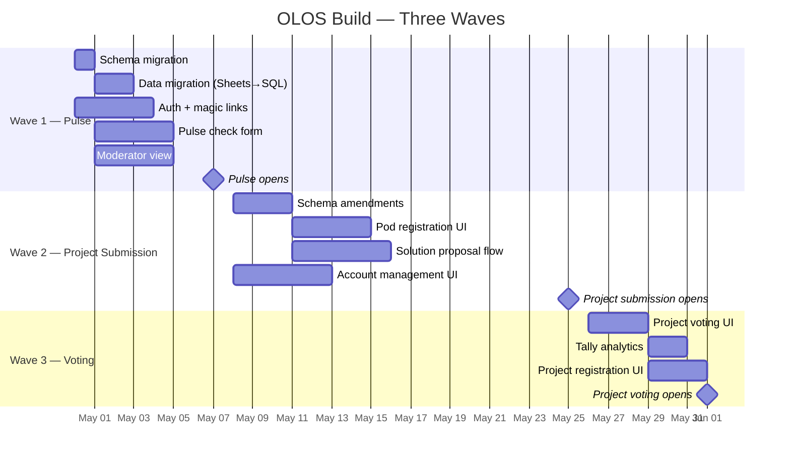
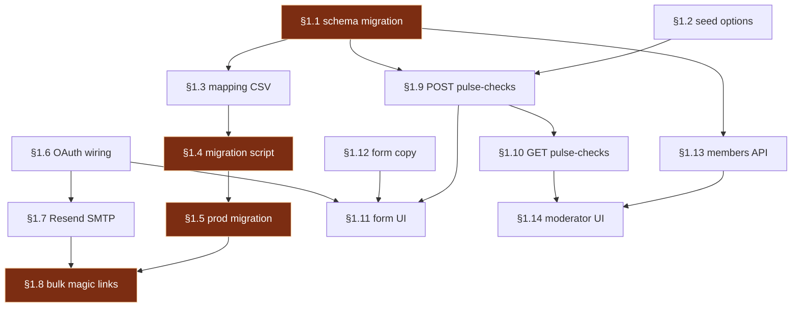

# OLOS — Roadmap
*The central long-term plan. This is the source of truth; issues reference back to it.*

**Status:** Living document. Update as decisions resolve and waves complete.
**Last updated:** April 30, 2026

---

## How to use this document

Every GitHub issue references a section anchor here (e.g. `Implements ROADMAP §1.1`). Section IDs are stable — once assigned, they don't change even if the issue is split, restructured, or reordered. This means the roadmap can be reorganized for readability without breaking issue links.

If a deliverable is added, give it a new ID rather than renumbering. If a deliverable is dropped, mark it `[DROPPED]` and leave the anchor in place.

---

## Goal

Replace the legacy spreadsheet-driven workflow (`Upskiller_Community_Manager.xlsx`) with OLOS — a custom application that walks Upskillers through ideation → pods → projects → showcase. Ship in three waves, each anchored to a phase deadline of the active Energy & Climate cycle.

---

## Three waves

---

# §1 — Wave 1: Pulse Opens (May 7)

**Goal:** participants can sign in via magic link and submit weekly pulse checks; moderators can see who has and hasn't.

## §1.1 — Schema migration: extend `participants` for legacy field parity
*Add the GAP fields surfaced by the spreadsheet comparison: `phone_number`, `email_updates`, `comms_consent`, `availability_notes`, `commitment_notes`, `interest_areas`, `moderator_experience`, `notes`. See `2026-04-30_schema_comparison.md` §3.1.*
- Issue: `ISSUE-W1-001`

## §1.2 — Seed `option_lists` per spec
*Populate the six lists (`ai_tools`, `labs_goals`, `availability`, `work_style`, `group_strengths`, `pulse_benefits`) so multi-select form fields have valid options to render and reference.*

**Partially absorbed by [`00010_pulse_check_v2.sql`](../supabase/migrations/00010_pulse_check_v2.sql) (PR #53):** that migration shipped `ai_tools` (61 rows, expanded for autocomplete) and `pulse_benefits` (7 rows, reworded for Labs value-prop alignment — supersedes `TUL_MVP_Spec.md`). Original spec values for `pulse_benefits` are retained with `active = FALSE` so historical `pulse_checks` references resolve.

**Remaining scope (W1-002 / PR #58):** ship the four spec-aligned lists `00010` didn't touch — `labs_goals`, `availability`, `work_style`, `group_strengths` (20 rows total) — via [`00012_seed_option_lists.sql`](../supabase/migrations/00012_seed_option_lists.sql). After this merges, all six lists are seeded to staging/prod via migrations rather than `seed.sql` (which is local-only).
- Issue: `ISSUE-W1-002` (PR #58)

## §1.3 — Build legacy column mapping CSV
*Produce a reviewable artifact mapping each spreadsheet column to its destination SQL column or junction-table option. Becomes input to the migration script.*
- Issue: `ISSUE-W1-003`

## §1.4 — Migration script: spreadsheet → Postgres (staging)
*Python script that reads `Upskiller_Community_Manager.xlsx`, applies the column mapping from §1.3, and writes to `participants`, `cycle_enrollments`, `participant_options`, `pod_memberships`, `problem_statements`, `votes`. Runs against staging only.*
- Issue: `ISSUE-W1-004`

## §1.5 — Production migration: Energy & Climate cycle
*Use the script from §1.4 against production. Active cycle only — historical Health Systems data stays in the workbook as test fixtures.*
- Issue: `ISSUE-W1-005`

## §1.6 — Wire Supabase Auth + Google OAuth
*Configure Google OAuth credentials in Supabase Auth; implement `POST /auth/google` in FastAPI; resolve roles from `user_roles`, `moderator_assignments`, `cycle_enrollments` and encode into JWT.*
- Issue: `ISSUE-W1-006`

## §1.7 — Configure Supabase magic links via Resend SMTP
*Configure Supabase Auth to deliver magic-link emails via Resend. Includes email template (subject, body, branded sender).*
- Issue: `ISSUE-W1-007`

## §1.8 — Bulk magic-link generator
*Admin script that iterates over migrated participants and triggers Supabase magic-link emails. Run once after §1.5 completes.*
- Issue: `ISSUE-W1-008`

## §1.9 — `POST /api/pulse-checks` endpoint
*Implement the endpoint per `TUL_MVP_Spec.md` §Pulse Checks, including JSONB validation and the `409 Conflict` rule for duplicate `scheduled_date + cycle_id`.*
- Issue: `ISSUE-W1-009`

## §1.10 — `GET /api/pulse-checks/{cycle_id}` endpoint
*Implement the read endpoint with role-based scoping (own records / moderator's pod / admin all).*
- Issue: `ISSUE-W1-010`

## §1.11 — Pulse-check form page (Next.js)
*Authenticated route at `/pulse-check`. Renders the survey, posts to §1.9, shows confirmation state.*
- Issue: `ISSUE-W1-011`

## §1.12 — Pulse-check form copy
*Final microcopy for question text, helper text, validation messages, confirmation state, error states.*
- Issue: `ISSUE-W1-012`

## §1.13 — `GET /api/pods/{pod_id}/members` with pulse status
*Per spec, but extend the response to include each member's most-recent `completed_at` for the pulse-check status indicator.*
- Issue: `ISSUE-W1-013`

## §1.14 — Moderator pod-members view
*Authenticated route at `/pods/[id]/members`. Lists members with a pulse-completion indicator (current week complete / missed / overdue). Visible to moderators of that pod, admins, owners.*
- Issue: `ISSUE-W1-014`

---

## Wave 1 dependency graph

**Critical path** (highlighted): §1.1 → §1.4 → §1.5 → §1.8. If any of these slips, the May 7 deadline slips. Everything else can run in parallel.

---

# §2 — Wave 2: Project Submission Opens (May 25)

**Goal:** pods are formed, moderators can manage them, participants can submit project proposals, and the team behind project voting can see the full data shape.

## §2.1 — Schema amendments: configurable `pod_limit`
*Move the hardcoded 2-pod cap to `cycle_config.pod_limit SMALLINT NOT NULL DEFAULT 2`. Refactor `POST /api/pods/{id}/register` validation to read from config.*
- Issue: TBD

## §2.2 — Schema amendments: problem statement context JSONB + `theme_track`
*Per the schema comparison §3.3, add `problem_statements.context JSONB` and `problem_statements.theme_track VARCHAR(100)` with index. Existing `statement_text` becomes the one-sentence summary.*
- Issue: TBD

## §2.3 — Account management UI: cycle config editor
*Admin form to edit `cycle_config` values: pod limit, project limit, vote thresholds, min/max members, all phase windows. Implements `PATCH /api/cycles/{id}/config` from spec.*
- Issue: TBD

## §2.4 — Pod registration: participant view
*Authenticated route showing the pod shortlist with problem statements, members, moderators, and a register button. Implements the "See their pods" board section.*
- Issue: TBD

## §2.5 — Pod self-registration form
*Implements `POST /api/pods/{id}/register` and `DELETE`. Includes the configurable cap check from §2.1.*
- Issue: TBD

## §2.6 — Solution proposal submission form
*Authenticated form scoped to a pod. Posts to `POST /api/pods/{id}/solution-proposals`. Single-submitter UX (per board annotation: multi-submission is functionally allowed but not promoted).*
- Issue: TBD

## §2.7 — Pulse-check moderator view: response review
*Extends §1.14. Moderators can read individual pulse responses for their pod members.*
- Issue: TBD

## §2.8 — Mentors table + onboarding flow
**[Conditional on D3 — see Open Decisions]**
- Issue: TBD

---

# §3 — Wave 3: Project Voting Opens (June 1)

**Goal:** active pod members can vote on solution proposals within their pod, see live tallies, and self-register for the resulting projects.

## §3.1 — Project voting form
*Implements `POST /api/pods/{id}/project-votes` with budget validation (default 3 votes per active pod member, no submitter differentiation per spec).*
- Issue: TBD

## §3.2 — Voting dashboard (real-time tallies)
*Per `TUL_MVP_Spec.md §UI Specifications`. Bar visualization with threshold line. Polling-based real-time updates.*
- Issue: TBD

## §3.3 — Project shortlist publication
*Implements `POST /api/pods/{id}/projects/finalize`. Tallies, filters by `project_vote_threshold`, ranks, creates up to `max_projects` projects in `forming` status. Includes LLM name generation.*
- Issue: TBD

## §3.4 — Project self-registration UI
*Implements `POST /api/projects/{id}/register` and `DELETE`. Enforces the 1-project-per-cycle exclusive constraint.*
- Issue: TBD

## §3.5 — Pulse-check response analysis
*Per the Wave 3 board section ("see analysis of responses"). Moderator dashboard view with aggregations across the cycle's pulse data: most-cited tools, most-cited benefits, help requests trend.*
- Issue: TBD

## §3.6 — Project membership view
*Per the Wave 3 board section ("see projects membership"). Moderator can see which of their pod's members ended up in which project.*
- Issue: TBD

---

# §4 — Backlog (post-Showcase)

## §4.1 — Participant-initiated pod join (NTH from board)
## §4.2 — Auto-add to pod resources on join (NTH)
## §4.3 — Project review workflow (NTH)
## §4.4 — Slack message on project submit → pod channel (NTH)
## §4.5 — Per-project Slack groups (NTH)
## §4.6 — Onboarding flow expansion
## §4.7 — Access revocation automation (Slack/Drive/GitHub/Groups APIs)
## §4.8 — Email notification scheduling
## §4.9 — Cycle closure side effects (spec Q7)

---

# §5 — Open decisions

These block specific issues. Resolve before the affected work starts.

| ID | Decision | Blocks | Owner | Status |
|---|---|---|---|---|
| D1 | Ranked-choice pod registration: preserve `preference_rank` column or flatten to bag-of-pods? | §1.4 (migration script — needs to know whether to write rank), §2.5 (registration form — needs to know whether to surface a rank picker) | TBD | OPEN |
| D2 | Vote-budget historical reconciliation: how was the Health cycle voting actually run? Per-voter 3-vote budget regardless of submission, or differential? | §1.4 (test data load only — does not block production) | TBD | OPEN |
| D3 | Mentors: separate `mentors` table, or unify into `participants` with `participant_type` enum? | §2.8 (mentor onboarding — affects entire flow) | TBD | OPEN |
| D4 | GAP field rollout: add all 8 to `participants` now (one migration), or trickle in as forms get rebuilt? | §1.1 (single migration vs phased) | TBD | RECOMMEND: single migration |

---

# §6 — Wave 1 status tracker

*Update this table as issues progress. Mark waves complete when all issues are merged + deployed.*

| Anchor | Issue | Status | Owner | PR | Notes |
|---|---|---|---|---|---|
| §1.1 | [ISSUE-W1-001](https://github.com/TheUpskillingLabs/OLOS/issues/39) | resolved | adm-2k | commit `4237b85` | Critical path. Shipped via `00011_extend_participants_legacy_fields.sql` on `main`. W1-002 branched from this. |
| §1.2 | [ISSUE-W1-002](https://github.com/TheUpskillingLabs/OLOS/issues/40) | in review | adm-2k | [#58](https://github.com/TheUpskillingLabs/OLOS/pull/58) | Partially absorbed by `00010_pulse_check_v2.sql`; PR ships the remaining 4 lists (20 rows) via `00012_seed_option_lists.sql`. |
| §1.3 | [ISSUE-W1-003](https://github.com/TheUpskillingLabs/OLOS/issues/41) | in progress | adm-2k | — | Folder guidance at [scripts/migration/CLAUDE.md](../scripts/migration/CLAUDE.md); 103 mapping rows authored at [scripts/migration/column_mapping.csv](../scripts/migration/column_mapping.csv). PS / Health-Voting row counts diverge from issue (20/19 actual vs 25/25 spec) — to be reconciled in PR review. |
| §1.4 | ISSUE-W1-004 | not started | — | — | Critical path; awaits D1. Test-data safety contract pre-recorded in [scripts/migration/CLAUDE.md](../scripts/migration/CLAUDE.md) *Test data strategy* — script must own anonymization of Health rows, prod connection-string guard, and frozen fixture snapshot before merge. |
| §1.5 | [ISSUE-W1-005](https://github.com/TheUpskillingLabs/OLOS/issues/43) | ran, data quality bad | adm-2k | — | Critical path. Script ran against prod (run logs at [scripts/migration/run_*.log](../scripts/migration/)); 26 enrollments landed but with quality issues. **Plan**: clear non-owner Energy data via [reset-energy-participants.sql](../scripts/ops/reset-energy-participants.sql) (PR #83), then have participants self-register through the form. Data-migration approach is being replaced with self-registration; issue should be re-scoped or closed accordingly. |
| §1.6 | [ISSUE-W1-006](https://github.com/TheUpskillingLabs/OLOS/issues/44) | in review | inferno-gh (MJ) | merged to main via PR [#60](https://github.com/TheUpskillingLabs/OLOS/pull/60) | Code complete on main. Spec's FastAPI JWT translated to `@supabase/ssr` session cookie + per-request role resolution. **Ratified 2026-05-08**: missing-participant case redirects to `/register` rather than 404 ([#63](https://github.com/TheUpskillingLabs/OLOS/issues/63), kept for UX + privacy reasons). See [lib/auth/CLAUDE.md](../lib/auth/CLAUDE.md). Blocked on ops: Google Cloud OAuth client + Supabase Studio Google provider + redirect allow-list. |
| §1.7 | [ISSUE-W1-007](https://github.com/TheUpskillingLabs/OLOS/issues/45) | resolved | inferno-gh (MJ) | merged to main via PR [#60](https://github.com/TheUpskillingLabs/OLOS/pull/60) | **Resolved 2026-05-09.** **Ratified 2026-05-08** ([#64](https://github.com/TheUpskillingLabs/OLOS/issues/64)): invitation emails delivered via direct Resend HTTP API rather than Supabase SMTP relay — driven by free-tier rate limits (Supabase auth-email throttle would block bulk-invite §1.8). Custom-token flow, not Supabase magic-link OTP. Resend domain `enroll.theupskillinglabs.org` verified (SPF + DKIM + DMARC); first prod send 2026-05-08; acceptance flow verified end-to-end on prod 2026-05-10 (side-effect rows landed across `participant_permissions`, `cycle_enrollments`, `moderator_assignments`). In-code default sender aligned to subdomain via PR [#68](https://github.com/TheUpskillingLabs/OLOS/pull/68). Unblocks bulk-invite §1.8 (#46). See [lib/auth/CLAUDE.md](../lib/auth/CLAUDE.md). |
| §1.8 | [ISSUE-W1-008](https://github.com/TheUpskillingLabs/OLOS/issues/46) | resolved | adm-2k | merged via PR [#70](https://github.com/TheUpskillingLabs/OLOS/pull/70) | Script at [scripts/ops/send-bulk-invites.ts](../scripts/ops/send-bulk-invites.ts). Dry-run + single-recipient sanity send verified on prod; full-cohort fan-out deferred per [scripts/ops/CLAUDE.md](../scripts/ops/CLAUDE.md) until §1.5 cohort lands. After the Energy reset (PR #83), re-run for the cleaned cohort. Dev/prod-split fix landed via commit `5e62e5a`. |
| §1.9 | [ISSUE-W1-009](https://github.com/TheUpskillingLabs/OLOS/issues/47) | absorbed | — | shipped pre-#47 | Stack pivoted from FastAPI to Next.js (per §1.6). POST endpoint shipped at [app/api/pulse-checks/route.ts](../app/api/pulse-checks/route.ts) — JWT-derived `participant_id`, 409-Conflict on duplicate `(participant_id, scheduled_date, cycle_id)`, nominations side-write, `last_pulse_completed_at` denorm on `participants`. Issue closure pending AC walkthrough. |
| §1.10 | [ISSUE-W1-010](https://github.com/TheUpskillingLabs/OLOS/issues/48) | superseded | — | n/a | No GET API endpoint needed — moderator review reads Supabase directly via [pulse-check-dashboard.tsx](../app/(dashboard)/pods/%5Bpod_id%5D/pulse-check-dashboard.tsx) with RLS enforcing role-based scoping. Re-open if a non-UI consumer of pulse history emerges. |
| §1.11 | [ISSUE-W1-011](https://github.com/TheUpskillingLabs/OLOS/issues/49) | shipped, AC gaps | — | shipped pre-#49 | Route at [app/(dashboard)/pulse-check/page.tsx](../app/(dashboard)/pulse-check/page.tsx); submits to `/api/pulse-checks` ([form line 197](../app/(dashboard)/pulse-check/pulse-check-form.tsx#L197)). **Gaps vs AC**: (1) "already submitted this week" UX missing — form renders even after submission and relies on server 409; (2) uses native React state, not `react-hook-form` + `zod`; (3) options read server-side from `option_lists`, not via `GET /api/options`. Locking semantic differs: 7-day-from-last-pulse, not week-anchored. Keyboard nav + inline error UX needs manual verification. |
| §1.12 | [ISSUE-W1-012](https://github.com/TheUpskillingLabs/OLOS/issues/50) | shipped | — | shipped pre-#50 | [copy.ts](../app/(dashboard)/pulse-check/copy.ts) — 13 keyed sections (page, status, context, reflection, forces, engagement, nominations, closing, submit, confirmation, history, locked, nav). No `TODO` / `Lorem ipsum` placeholders. Stakeholder-review AC is a process item (Brendan / Ann Marie), not a code item. Copy work — non-engineering. |
| §1.13 | [ISSUE-W1-013](https://github.com/TheUpskillingLabs/OLOS/issues/51) | shipped, AC gap | — | shipped pre-#51 | [app/api/pods/[pod_id]/members/route.ts](../app/api/pods/%5Bpod_id%5D/members/route.ts) exists with `?status=active` filter + RLS-based 403. **Gap**: response does NOT include `last_pulse_check.{scheduled_date, completed_at}` per AC. UI side-steps the gap by querying `pulse_checks` directly server-side from the pod detail page. Either extend the route OR close acknowledging the bypass. |
| §1.14 | [ISSUE-W1-014](https://github.com/TheUpskillingLabs/OLOS/issues/52) | shipped, AC gaps | — | shipped pre-#52 | Members table + `PulseCheckDashboard` render at [app/(dashboard)/pods/[pod_id]/page.tsx](../app/(dashboard)/pods/%5Bpod_id%5D/page.tsx), gated on `isAdmin / isModeratorForPod / pulse_checks:read`. **Gaps vs AC**: (1) route is `/pods/[id]`, not `/pods/[id]/members`; (2) members table shows active/inactive, not per-member pulse indicator — pulse data lives in a separate aggregate-stats dashboard below; (3) no traffic-light semantics (green/yellow/red); (4) no sortable list + URL query param; (5) non-moderator visitors see the page without the pulse dashboard rather than a hard 403. |

---

# §7 — Assumptions to verify

These were inferred from the dashboard screenshot and earlier conversation but haven't been confirmed:

1. **Cycle list + cycle detail UI is already shipped.** The April 30 dashboard screenshot showed a working cycle timeline. If this is mocked rather than wired to real data, add issues to §1 to wire it up.
2. **Participant authentication has SOME implementation.** Aaron is shown logged in. If this is just a stub, §1.6 needs to be expanded.
3. **The `pulse_checks` table doesn't exist yet in the production DB.** §1.1 includes creating it.
4. **No staging environment exists.** §1.4 may need to provision one before the script can run against it.

Confirm or correct each before starting Wave 1.
