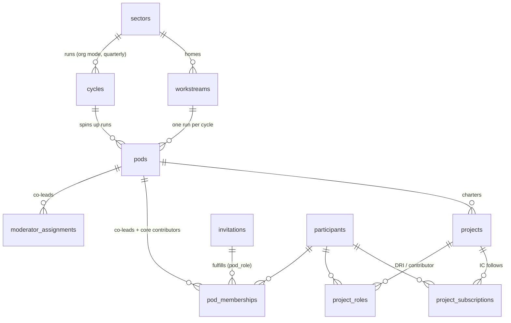

# Org cycles — the org runs its own cycle structure, on itself

> **Local Labs note (migrations `00062`/`00067`, `docs/LOCAL_LABS.md`):**
> the ORG pattern described here is HQ's instance of a now-general shape:
> each local lab (metro) can run its own `mode='org'` cycle for its
> leadership/workstream teams — the org invariant is per lab
> (`one_active_org_cycle_per_lab`), with HQ as the `lab_id IS NULL` stream.
> The PARTICIPANT (`mode='open'`) track is different: it is a single HQ
> quarterly cycle that every lab joins automatically as a sub-cohort
> (`pods.lab_id` tags each lab's slice) — labs do not run their own open
> cycles (00067). HQ workstreams keep `sector_id` (the seeded HQ sector);
> lab workstreams carry `lab_id` instead.

**Status:** 2026-07, owner-ratified. **First slice shipping:** migration
`00060` (`cycles.mode='org'`, the per-mode active/upcoming invariants,
`workstreams`, the `project_roles`/`project_subscriptions` IC ladder,
`invitations.pod_role`), the mode-aware read path (`getOrgCycle` alongside
`getOperatingCycle`/`getRecruitingCycle`), the per-cycle Learning Log gate,
the manual quarterly roll-forward primitives (`POST /api/cycles` +
`POST /api/admin/workstreams/[id]/runs`, with roster-copy), and the
entities described below. **The UI is reused, not rebuilt** — a workstream
run is an ordinary pod, so it renders in the existing Poderator/pod
dashboard as-is. It picks up org-flavored **labeling** on the way
(`lib/cycle/labels.ts`'s `podNoun`/`moderatorNoun` render "Workstream" /
"Co-lead" instead of "Pod" / "Poderator" wherever a page already reads
`cycle.mode`), and the member dashboard's "Your workstreams" section and
the admin workstreams-panel are real, shipped surfaces — but there's no
*dedicated* `/org`-flavored route, and the nav persona still says
"Poderator" for a co-lead (see §6). **Design-only, not yet built:** the IC
fork endpoint/UI and the governance questions in *§7*.

**Companion:** [`SECTOR_MODEL.md`](SECTOR_MODEL.md) — this doc is a
**sibling**, not a restatement. Everything below assumes you've read that
doc's sectors/cycles/pods/projects model; here we only describe what's
*different* when the "cohort" is the org itself. Schema detail lives in
[`SCHEMA.md`](../SCHEMA.md) §*ERD — Org Cycles & Workstreams*; the shipped
DDL is [`supabase/migrations/00060_org_cycles_and_workstreams.sql`](../supabase/migrations/00060_org_cycles_and_workstreams.sql).

---

## 1. Why this exists

The Labs' own HQ team and Core Contributor community want the same
structure participant cohorts get — a time-boxed cycle, durable
work-units, a co-lead/contributor/subscriber ladder, a weekly practice
ritual — for **internal workstreams** ("Moderator tooling," "Sector
governance," "Data Sensemaker build-out"). Rather than fork a parallel
"internal projects" system, the org **dogfoods the participant cycle
machinery**: an org cycle is a `cycles` row exactly like a participant
cycle, just `mode='org'` instead of `mode='open'`, under a seeded sector
that represents the org itself. The whole org becomes the cycle theme.

This buys two things at once: the internal tooling gets the lifecycle,
roles, and ritual discipline that's already been designed and built for
participants, and every gap discovered running it on real internal work
(a co-lead who needs to be removed, a workstream that goes dormant
mid-quarter, a Friday gate that's genuinely annoying) is a gap in the
*shared* machinery — fixing it for the org fixes it for participants too.

## 2. The mapping (org concept ↔ mechanism)

| Org concept | Mechanism |
|---|---|
| **Org sector** | `sectors` row **"The Upskilling Labs HQ"** (`slug='the-upskilling-labs-hq'`), seeded by `00060`. Trivial lookup row — sectors have no CRUD yet (`SECTOR_MODEL.md` §7), and an org cycle needs a `sector_id`. |
| **Org cycle** | `cycles.mode='org'` — quarterly runs under that sector. ≤1 `active` + ≤1 `upcoming` **among `mode='org'` cycles** (partial unique indexes, `00060`), running **concurrently** with the open participant cycle: `00048`'s single-active-cycle invariant is rescoped to `mode='open'` only, per `SECTOR_MODEL.md` §4's already-deferred `mode='closed'` carve-out. |
| **Workstream** | the new, durable `workstreams` table — cross-cycle, doesn't reset each quarter. Each quarter's org cycle spins up a **run** per active workstream, and a run is just an ordinary `pods` row (`pods.workstream_id` FK), created `status='active'` with `problem_statement_id` **NULL** — chartered by the workstream directly, never voted into existence from a problem-statement ballot the way a participant pod is. UI language says "Workstream"; the code says `pod` — the same split as "Poderator" (UI) / `moderator_assignments` (code). |
| **Workstream co-lead = DRI** | `moderator_assignments` **+** `pod_memberships` on the run pod. Both rows matter: the membership is load-bearing because `reconcileEnrollmentActivation` (`lib/enrollment/reconciler.ts`) demotes a `cycle_enrollments` row to `inactive` for anyone with no active pod membership, org co-leads included. |
| **Core contributor** | invite-only `pod_memberships` on the run. `invitations.pod_role` (`'member'` \| `'co_lead'`, added in `00060`) drives fulfillment: `co_lead` writes `moderator_assignments` + `pod_memberships`, `member` writes `pod_memberships` only. Self-serve pod registration is rejected for org cycles (§5). |
| **IC (any signed-in member)** | `project_subscriptions` — self-serve follow, no invite needed — plus `project_roles` for anyone promoted onto a project: `role='contributor'` (DRI-invited) or `role='dri'` (a post-hoc DRI grant, not just the founding cohort). A fork is a `projects.forked_from_project_id` pointer only — provenance, no endpoint or UI yet. |
| **Board / exec** | the existing `admin`/`owner` role presets. Unchanged — org cycles don't add a new staff tier. |

## 3. Entities

`one_run_per_workstream_per_cycle` (partial unique on
`pods(workstream_id, cycle_id)`) caps a workstream at one run per org
cycle. Nothing else about `pods`/`pod_memberships`/`moderator_assignments`
changes shape — an org run is a normal pod row read by normal pod code.

## 4. Rituals: the Friday gate is per (active cycle × active enrollment)

Org members file the same weekly + milestone Learning Logs as
participant-cycle members and **are** subject to the Friday gate —
dogfooding means feeling the same cadence pressure, not an exemption.

Because an org cycle and the participant ('open') cycle can now both be
`status='active'` at once, and a dual-enrolled staff member can hold an
active `cycle_enrollments` row in both, the gate stopped being a single
per-member yes/no and became **per cycle** (owner-ratified semantics,
implemented in [`lib/learning-logs/gate-logic.ts`](../lib/learning-logs/gate-logic.ts)'s
`resolveGate`, tested in the sibling `gate-logic.test.ts`):

- A member is **locked** if **any** armed cycle they're actively enrolled
  in has no learning-log row carrying **that cycle's `cycle_id`** at/after
  its `cycle_config.log_due_at` stamp. "Armed" = a due-date has been
  stamped and `log_gate_paused` is false; an unstamped or paused cycle
  never contributes to the lock.
- A **dual-enrolled staff member** (active in both the open cycle and the
  org cycle) must file **one log per cycle** — clearing the participant
  cycle's window does not clear the org cycle's, and vice versa.
- **Behavior change from the pre-org gate:** a standalone log
  (`cycle_id` NULL) used to clear the gate for any active cycle — "any log
  clears." It no longer does. With two concurrent windows, "any log, any
  cycle" stopped being a well-defined signal, so a log must now be
  attributed to the specific cycle whose window it's satisfying.
- Members enrolled in no active cycle, or only in cycles whose gate isn't
  armed, are never gated — this is cycle practice, not a site-wide toll.

### 4a. The Leadership Log cascade (migration 00069)

The org tier runs a **staggered weekly cascade** so each level reflects in the
context of the level below — members Wednesday, workstream leads Thursday, lab
leads Friday. Concretely:

- **Members** file the ordinary weekly Learning Log, but for org cycles it is
  armed **Wednesday** (participant cycles stay Friday) and carries three extra
  **work fields** (`work_summary` / `work_progress` / `work_blockers`, 00069) —
  the owner's "both a learning log + work log fields." It keeps the hard gate.
- **Workstream leads** and **Lab Leads** file a separate **`leadership_logs`**
  entry — the "Leadership Log" — scoped to their run pod (`workstream_lead`,
  Thursday) or their lab (`lab_lead`, Friday). It is **non-blocking** (a
  dashboard due card + a reminder email, no lockout) and is composed beside a
  read-only view of the tier below's logs: a workstream lead reads their run
  members' Learning Logs; a lab lead reads their workstream leads' Leadership
  Logs (cross-tier reads via service-role, authorized to the reader's own
  team). A co-lead files **both** the Wednesday member Learning Log and their
  Thursday Leadership Log — that is intended.
- Window is config-as-data like the Learning Log: a Wednesday cron stamps
  `cycle_config.leadership_log_due_at` (and the org `log_due_at`); per-tier
  target days are derived offsets. `leadership_log_gate_paused` is the admin
  grace toggle. The HQ org cycle (`lab_id NULL`) has no lab-lead tier.

## 5. Lifecycle

Org cycles run the **same** state machine as participant cycles —
`draft → upcoming → active → closing → archived` (`SECTOR_MODEL.md` §4) —
with one structural difference: **org cycles never have a scheduled
formation window.** There's no problem-statement ballot, no pod-formation
vote, no project-proposal window to open — a run is chartered straight
from its workstream and co-leads are assigned, not elected. This is
enforced twice:

1. **Explicitly** — [`rejectOrgCycle`](../lib/cycle/guards.ts) 403s any
   route whose mechanics assume voting or self-serve formation (e.g.
   `advance-phase`) the moment it resolves an org-mode cycle id.
2. **Implicitly, as a backstop** — [`checkWindow`](../lib/auth/windows.ts)
   (`lib/auth/windows.ts`) returns `{ open: false }` whenever a
   `cycle_config` window's open/close timestamps are NULL, which they
   always are for an org cycle, since nothing ever stamps them. Routes
   that gate on `checkWindow` (pod registration, voting, project
   registration) stay closed for org cycles even if a call site forgets
   the explicit guard.

**Quarterly rollover:** create the next quarter's org cycle
(`POST /api/cycles`), then, per **active** workstream, create its run with
an option to copy the prior run's co-lead/contributor roster forward
rather than starting empty
(`POST /api/admin/workstreams/[workstream_id]/runs`, `copy_from_cycle_id`
— surfaced in the admin cycle workspace's workstreams panel as a "Copy
roster from…" dropdown next to "Create run"). Both endpoints exist and are
wired to UI this slice. What's **still** a manual, one-off admin action:
nothing automatically creates next quarter's org cycle or fires the
per-workstream run creation on a schedule — an admin does both steps by
hand, once per quarter, workstream by workstream.

## 6. What is deliberately NOT done in this slice

- **Not overloading `cycle_enrollments.tier`.** `tier` is `member`/
  `contributor`, CHECK-constrained and semantically tied to the Hackathon
  cutoff (`SECTOR_MODEL.md` §7). Org cycles have no Hackathon; reusing
  `tier` for co-lead/contributor would conflate two unrelated ladders
  under one column instead of adding a real one.
- **Not reading `participant_roles`.** `00054`'s unified role table stays
  **write-only** for now (backfill inserts only, no read call site yet).
  The org layer resolves roles from `moderator_assignments`,
  `pod_memberships`, `project_roles`, and `user_roles` directly. The drift
  between those sources and `participant_roles` is real and is being
  **documented, not silently reconciled**, here.
- **Not routing org project membership through `project_memberships`.**
  That table's `one_active_project_per_cycle` invariant would cap a staff
  member at one org project per cycle — wrong for people who touch several
  workstreams' projects at once. `project_roles` has no such ceiling; it's
  the org-side membership primitive on purpose.
- **No fork endpoint or UI.** `projects.forked_from_project_id` is
  provenance-only this slice — a column to point at, nothing reads or
  writes it yet outside manual/service-role use.
- **No dedicated co-lead nav persona.** Page copy that already knows the
  cycle's mode does render "Workstream"/"Co-lead" via
  [`lib/cycle/labels.ts`](../lib/cycle/labels.ts) (the pod page, the
  project page's breadcrumb, the member dashboard's "Your workstreams"
  section, the admin workstreams panel). What's **not** built is a
  separate co-lead persona or a dedicated `/org` route family — the global
  nav and the Poderator dashboard shell are reused unmodified, so anything
  outside those already-mode-aware surfaces still says "Poderator." A
  workstream run renders on the same `/pods/[pod_id]` route a participant
  pod does, because it *is* one.
- **No scheduled roll-forward.** See §5 — the run-creation-with-roster-copy
  endpoint and its admin UI exist; nothing automates *invoking* them each
  quarter, and nothing auto-creates the next org cycle.
- **No B2B closed-track concurrency.** `SECTOR_MODEL.md` §10 already
  defers `mode='closed'` cycle concurrency; org cycles don't reopen that
  question, they just add a third mode alongside it.
- **Admin/moderator UI still doesn't differentiate the two worlds.** The
  reuse described above means `/admin`, `/admin/people`, and `/moderator`
  render org cycles and participant cycles through the same components with
  no mode-aware sectioning, labeling, or nav — [`PRD-admin-org-separation.md`](PRD-admin-org-separation.md)
  is the plan of record for closing that gap, phased.

## 7. Open questions / deferred

1. **Org steering committee analog.** `SECTOR_MODEL.md` §10 defers a
   Sector Steering Committee for participant sectors; the org sector has
   the identical open question. Board/exec (`admin`/`owner`) sit above
   workstream co-leads today, but nothing models a body that seats,
   sunsets, or arbitrates between workstreams the way a steering
   committee would.
2. **Does an org cycle ever publish to the commons?** Participant sectors
   accumulate field research and knowledge-graph output that's meant to
   surface publicly (`SECTOR_MODEL.md` §2, §11). Whether org-cycle output
   (internal retros, workstream docs) ever crosses that line — in whole,
   in part, or never — is undecided.
3. **Do ICs get a follow feed?** `project_subscriptions` records the
   follow; there's no notification surface or feed reading it yet. Whether
   subscribing should produce any signal back to the subscriber is
   deferred along with the rest of the "reuse UI" gap in §6.
4. **Workstream dormancy mid-run.** `workstreams.status` is `active` /
   `dormant`, and only `active` workstreams get a run spun up at cycle
   start (`SCHEMA.md` §*ERD — Org Cycles & Workstreams*). Nothing defines
   what happens to an **already-created** run's pod, co-leads, or project
   if its workstream flips to `dormant` mid-quarter.
