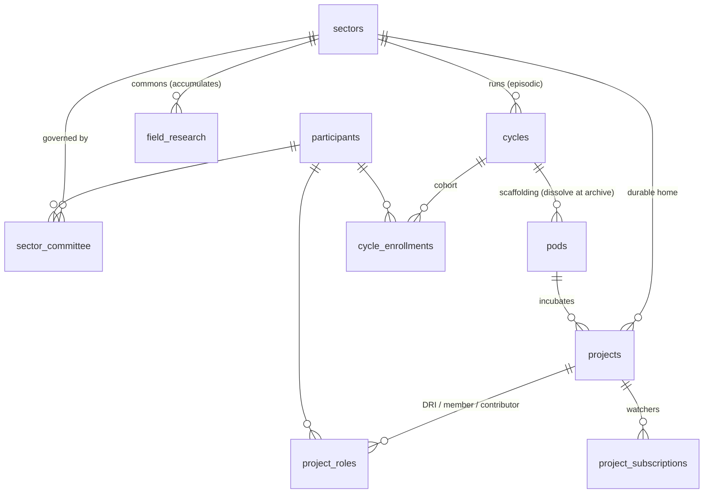

# Sectors, the cycle lifecycle, and open-source governance

**Status:** 2026-07, owner-driven. This is the target model; it supersedes the
flat single-active-cycle assumption. **Phase A (foundation) has shipped**
(migrations `00048`/`00049` — the `sectors` table, `cycle.sector_id` + `mode`,
the extended lifecycle, the ≤1-active/≤1-upcoming invariants, and the
operating-vs-recruiting read split). **Phases B–D remain design-on-paper.**
Build happens in phases (see *§9 Phased plan*).

**Companions:** `SENSEMAKING_FLOW.md` (how a cohort goes from field survey to
formed pods — the Paradox Sprint mechanic) and `ORTELIUS_KNOWLEDGE_GRAPH.md` (the
sector-scoped knowledge graph the commons accumulates into).

---

## 1. Why this exists

Today OLOS assumes **one cycle is the entire world**: `cycles.status ∈
{draft, active, closed}`, and ~10 reads resolve "the cycle" with
`.eq('status','active').maybeSingle()`. That can't express what The Labs
actually runs:

- **Several cycles are alive at once**, in different roles — recruiting the
  next cohort, running the current one, winding one down.
- **Work outlives a cycle.** Projects, field research, and the sensemaking
  knowledge graph *accumulate* across cohorts instead of resetting.
- **Governance hands off.** A project is staff-facilitated during a cycle, then
  becomes **member-self-governed** once the cohort ends.

The symptom that surfaced this: two cycles were both `status='active'`, which
breaks every `.maybeSingle()` active-cycle read and makes the dashboard pick the
*future* cohort over the running one. The real answer isn't "enforce one active
cycle" — it's that the model needs more states and a second entity.

## 2. The organizing principle: The Labs runs like open source

A **Sector** is the durable community around a problem domain. A **Cycle** is a
time-boxed cohort that incubates new projects and people into that sector. When
a cohort ends, its projects **graduate** to member governance and live on under
the sector. This is the open-source incubation → graduation lifecycle, and it's
already latent in the product (the Open Cycle Agreement, the MIT / CC-BY
commons, "the projects are open-source community projects — when the cycle's
over you're free to do whatever you want with it, and so is everyone else").
Pods already carry a `github_repo_url`, a `slack_channel_id`, and a
`drive_folder_id` — the repo mapping is literally in the schema.

| The Labs | Open-source analog |
|---|---|
| **Sector** (e.g. *Energy & Climate*) | a foundation / GitHub org — durable community + commons |
| **Cycle** (a named run under a sector) | an incubator cohort / release train |
| **Project** | a repo |
| **DRI(s)** — the **3–5 cohort members who form a project** | maintainers — invite, decide, merge; DRIs can invite new DRIs, incl. after close |
| **Cohort member** (registered before the Hackathon) | votes on formation (problem + proposal ballots) |
| **Contributor** (DRI-invited) | collaborator — commits, no governance vote |
| **Subscriber** (self-serve) | watcher / star — follows, no access |
| **Sector Steering Committee** *(deferred)* | TSC / board — not modeled yet |
| **Graduation** (cycle archives → project self-governs) | Apache Incubator "graduated" / CNCF sandbox → graduated |
| **Field research + knowledge graph** | the commons — docs, RFCs, shared knowledge |
| **Open Cycle Agreement · MIT / CC-BY** | the license + contributor agreement |

## 3. Entities



- **Sector** — durable, living, member-governed. Owns projects (across runs),
  field research + the knowledge graph, and a steering committee.
- **Cycle** — a *run of a sector* (`cycle.sector_id`). Episodic. Produces pods
  (transient) and projects (durable). "Energy & Climate" is the **sector**; a
  cohort is e.g. "Energy & Climate — Summer '26".
- **Pod** — cohort scaffolding. Dissolves when the cycle archives.
- **Project** — the durable unit. Born in a pod during a cycle; graduates to the
  sector, where it becomes member-managed.

## 4. Cycle lifecycle

```
draft ──▶ upcoming ──▶ active ──▶ closing ──▶ archived
          (recruiting)  (operating) (hand-off)   (cohort shell retired;
                                                   projects live on in sector)
```

| State | Member registration | Contributor / subscriber | Governance |
|---|---|---|---|
| **draft** | — | — | staff (invisible to members) |
| **upcoming** | **open** (recruit next cohort) + early read access to the sector's field data | — | staff |
| **active** — pre-Hackathon | **open** until the **Hackathon** milestone | — | staff / Poderators |
| **active** — post-Hackathon | **closed** | subscribe to projects; **DRI-invited** to contribute | staff / Poderators |
| **closing** | closed | — | **hand-off runs here** |
| **archived** (cohort shell) | — | subscribe / contribute continues | **member-managed + Steering Committee** |

- **"Three cycles at once"** = one `upcoming` + one `active` + one `closing`
  around a boundary. Steady state is usually two.
- **Registration is gated by the Hackathon milestone**, not the cycle end: you
  become a **member** (with a vote) only if you register before the Hackathon.
  After that the cohort is closed to new members, but projects take
  contributors.
- **Invariant:** The Labs runs **one _open_ cycle at a time** — ≤1 `active` and
  ≤1 `upcoming` among `mode='open'` cycles, org-wide (matches "the current active
  cycle", singular). **Closed (B2B) cycles** (`mode='closed'`, the prototype's
  `CYCLE.mode`) are a separate track that may run in parallel — their concurrency
  and management are deferred (§10).
- **Archive is a governance flip, not a shutdown:** the cohort shell + pods
  retire; **projects stay active** and detach from staff oversight.

## 5. Roles & authority (the open-source ladder)

Per **project** (the durable unit):

| Role | How you get it | Can do |
|---|---|---|
| **Subscriber** | self-serve (watch/follow) | see updates; request to contribute |
| **Contributor** | **invited by a DRI** | do the work; **no governance vote** |
| **DRI** | the **3–5 cohort members who form the project**; more can be **invited by existing DRIs** (incl. after the cohort closes) | invite contributors + DRIs, decide, "merge", steward the repo/commons |

There is no separate "member" role *inside* a project — the founding cohort
members simply **are** its DRIs. The ladder is exactly GitHub's: **watch →
collaborator (by invite) → maintainer**, and maintainers add maintainers.

Per **cohort (cycle)** — a governance tier that gates *formation* voting:

- **Cohort member** — registered before the Hackathon; votes on problem
  statements + solution proposals.
- **Cohort contributor** — joined after the Hackathon; works on pods/projects,
  no formation vote.

Per **sector** — governance beyond the DRIs (a **Steering Committee**) is
**deferred** (§10); until then a graduated project is run by its DRIs.

## 6. The graduation transition (active → archived)

When an admin closes a cohort (manual action — a human decides when pods
dissolve):

1. Cycle `active → closing → archived`.
2. **Pods dissolve** — `pods.status='dissolved'`, memberships closed. (The
   GitHub repo / Slack / Drive assets can persist or transfer to the project.)
3. **Projects move to the sector** — set `projects.sector_id`,
   `projects.governance='sector'`. Projects **stay active**.
4. **Governance flips** — staff/Poderator oversight removed; the project's
   **DRIs** (its founding 3–5, plus any they've since invited) become the sole
   maintainers and run it themselves. *(A sector-level Steering Committee over
   the set is deferred — §10.)*
5. **Commons rolls up** — the cohort's field research + knowledge graph
   accumulate onto the sector (they don't reset for the next run).

## 7. Data model (concrete)

New / changed (details finalized at build time):

- **`sectors`** — `id, name, slug, description, status, created_at`.
- **`cycles`** — `+ sector_id FK`; `+ mode ('open'|'closed')` (prototype
  `CYCLE.mode`; the single-active invariant applies to `open` only); status enum
  → add `upcoming`, `closing`, `archived`; `name` becomes the *cohort* name.
  Member-registration cutoff = the Hackathon anchor event (already in `EVENTS` /
  cycle milestones) or an explicit `cycle_config.member_registration_close`.
- **`cycle_enrollments`** — `+ tier ('member'|'contributor')`: `member` =
  registered before the Hackathon (formation vote); `contributor` = after.
- **`projects`** — `+ sector_id FK`, `+ governance ('cycle'|'sector')`.
- **`project_roles`** — `participant_id, project_id, role ('dri'|'contributor'),
  invited_by, created_at`. On formation the founding 3–5 registrants are written
  as `dri`; DRIs invite more `dri`s or `contributor`s. Durable successor to
  per-cycle project registration; `pod_memberships` stays cohort-scoped.
- **`project_subscriptions`** — `participant_id, project_id, created_at`
  (self-serve watch; a subscriber asks, a DRI invites → `contributor`).
- **`clusters` + `pods.cluster_id`** (formation) — a cluster is a proto-pod on
  the shared Paradox-Sprint canvas (`+ cycle_id`). Pod-formation **votes retarget
  from `problem_statements` to `clusters`** (a repoint of the existing ballot).
  Winners clearing `pod_min` (12) become pods (`pods.cluster_id` = provenance);
  **every** cluster — pod or not — is retained as sector data. Full mechanic:
  `SENSEMAKING_FLOW.md` §6.
- **`solution_proposals`** — require ≥1 linked **`actant` of role
  `problem_owner`** by submission (the actant gate: name who the intervention is
  for; `SENSEMAKING_FLOW.md` §6, `ORTELIUS_KNOWLEDGE_GRAPH.md` §4a actant layer).
- **`field_research` / knowledge graph** — `+ sector_id` scoping on the survey
  pool + Triangulator sensemaking so it accumulates and upcoming members can
  read it early. Concrete field-survey spec (`field_surveys` / `survey_responses`,
  the Civics & Elections instrument): `SENSEMAKING_FLOW.md` §3.
- **`participants.sector` → `industry`** — the existing free-text industry
  field is renamed to free the word "sector" for the new entity.
- *(deferred)* **`sector_committee`** — not modeled yet (§10).

## 8. Code implications

- The single "active cycle" lookup splits into two intent-named helpers:
  - **`getOperatingCycle()`** → `status='active'` — dashboard, learning-log
    gate, formation, crons. *(behavior unchanged)*
  - **`getRecruitingCycle()`** → the cohort whose member window is open
    (`upcoming`, else `active` pre-Hackathon) — the **signup funnel + join flow
    target this**.
- ~10 `.eq('status','active').maybeSingle()` sites get repointed to the right
  helper; `.maybeSingle()` becomes safe again under the ≤1-active invariant.
- Partial unique indexes enforce ≤1 `active` and ≤1 `upcoming`.
- The two activation paths (`/api/cycles/[id]/status` and
  `/api/cycles/[id]/advance-phase`) get a friendly guard so a second `active`
  returns a clear 409 instead of a raw DB error.

## 9. Phased plan

- **Phase A — Foundation & correctness ✅ (migrations `00048`/`00049`).**
  `sectors` + `cycle.sector_id` + `mode` + `project.sector_id`/`governance` +
  `cycle_enrollments.tier`; lifecycle states (draft→upcoming→active→closing→
  archived); ≤1-active/≤1-upcoming partial unique indexes + activation-route
  guards; dev reconciled (Civics → `upcoming` under a Civics & Elections sector,
  Energy & Climate `active` under its own); reads split via `lib/cycle/active.ts`
  (`getOperatingCycle`/`getRecruitingCycle` — the signup funnel targets
  recruiting). *(This also permanently fixed the two-active bug.)* Historical
  backfill of the generic Spring cohorts onto sectors is deferred (§10 naming).
- **Phase B — Windows & tiers.** Member-registration window tied to the
  Hackathon milestone; the member/contributor/subscriber ladder + DRI invites;
  funnel targets the recruiting cycle.
- **Phase C — Graduation.** The close→archive transition (dissolve pods, move
  projects to the sector, flip governance); sector portfolio pages.
- **Phase D — Living sector.** Field-research + knowledge-graph rollup + early
  access for upcoming members; sector knowledge-graph surfacing. *(Steering
  Committee deferred until the sector-governance model is decided.)*

## 10. Open questions / deferred

1. **Closed / B2B cycles** — `mode='closed'` cycles for B2B customers are a
   separate track (may run in parallel, may not publish to the commons). Their
   concurrency model, visibility, and management are **deferred**; the open-cycle
   single-active invariant does not constrain them.
2. **Sector Steering Committee** — **deferred.** Until designed, a graduated
   project is governed solely by its DRIs. Open when we get there: seating, term,
   and powers (admit/sunset projects, steward the commons).
3. **Knowledge graph** — the concrete model for the Triangulator sensemaking
   output as a sector-scoped, accumulating artifact. **Teed up in its own
   sub-doc: `docs/ORTELIUS_KNOWLEDGE_GRAPH.md`** (Project Ortelius / the Living
   Atlas) — a far bigger build, scoped for a future Fable + ultracode session.
4. **Cohort naming** — convention for a run under a sector ("Energy & Climate —
   Summer '26"?), and how existing cycles backfill onto sectors.
5. **DRI removal** — DRIs can invite DRIs; can a DRI be *removed*, and by whom?
6. **Org-internal track** — the org-internal cycle layer now exists as a
   sibling consumer of the same primitives (sectors, cycles, pods,
   projects) — see `docs/ORG_CYCLES.md` (`mode='org'`, migration `00060`).

## 11. Decisions locked (owner, 2026-07)

- Sectors accumulate projects **and** field research **and** the knowledge graph
  across runs (theme-based, not 1:1 per cohort).
- Member registration is open through the **Hackathon**; after that the cohort
  is closed to members but open to subscribers/contributors.
- Upcoming-cohort members get **early read access** to the sector's prior field
  research **and** the current field survey.
- Archive **does not** shut projects down — cycle + pods archive, projects move
  under the sector and become **DRI-managed** (little/no staff oversight).
- **Contributors subscribe** to a project self-serve; officially joining as a
  contributor requires a **DRI invitation**.
- The Labs runs **one open cycle at a time** (≤1 active + ≤1 upcoming among
  `open` cycles); **closed B2B cycles** are a later, separate track.
- A project's **DRIs are its founding 3–5 cohort members**; DRIs can invite new
  DRIs, including after the cohort closes.
- The **Sector Steering Committee is out of scope for now** — graduated projects
  are run by their DRIs.
- Rename `participants.sector` → `industry`; the Sector is the brand, cohorts
  are named runs under it.
- **Pods form by clustering, not by pre-set statements** — the "Problem Sprint"
  is renamed the **Paradox Sprint**; personal canvases merge, participants
  cluster hypotheses, **second** connections, and **vote on clusters**; winners
  clearing `pod_min` (12) become pods. **Nobody loses** — all clusters are
  retained as sector data (`SENSEMAKING_FLOW.md`).
- Evidence is grounded **bottom-up in a widely-distributed field survey**;
  extraction is **AI-assisted but never in-app** (deterministic prompt →
  member's own LLM → upload). Evidence→hypothesis edges are three-valence
  (`supports / complicates / refutes`).
- By **project proposal**, a team must have identified a real **problem owner**
  in the field (identified, not necessarily converted).
- **The whole thing follows open-source core practices.**
