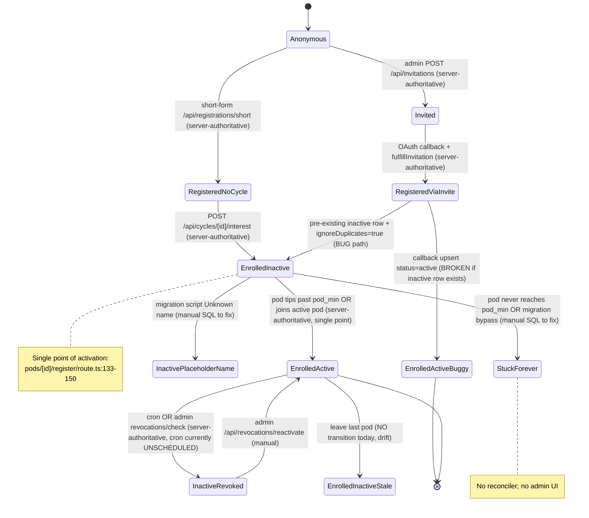
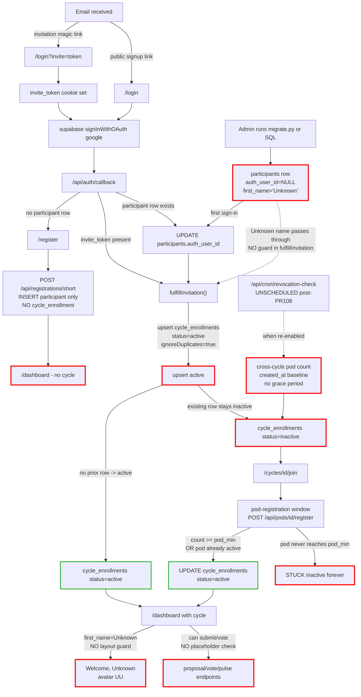
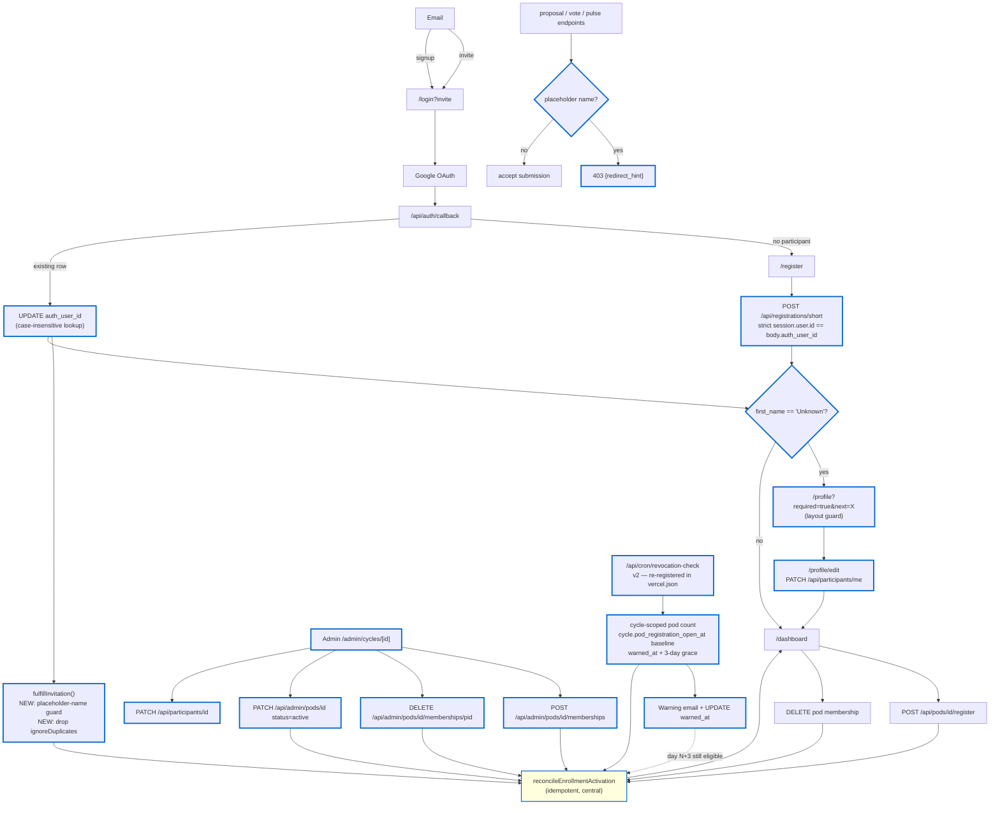

# OLOS Onboarding State Machine — Architecture Review

## Executive Summary

OLOS has a structurally coherent set of authentication, registration, pod, enrollment, cron, and admin subsystems, but the **participant lifecycle state machine is fragmented across at least 8 mutation sites with no central reconciler**. The `cycle_enrollments.status inactive -> active` transition — the single most important business event in the platform — is fired from exactly one code path (`app/api/pods/[pod_id]/register/route.ts:133-150`), while pods and pod_memberships are mutated from many. The result was the May 2026 Energy cascade (a daily cron + cross-cycle bug + missing grace period revoked ~75% of the cohort) and three stranded `Unknown`-name participants (migration script wrote placeholder rows; no UI exists to fix them). This document maps every write site, names the broken edges, and proposes a 3-phase consolidation: (A) extract a `reconcileEnrollmentActivation` helper and fix the invitation-callback `ignoreDuplicates` bug, (B) ship the admin/moderator UI for the manual fixes currently requiring SQL, (C) redesign the revocation cron with cycle-scoped checks, grace periods, and a warning state.

---

## 1. Current State Assessment

### 1.1 Five subsystems, one machine

The six subsystem maps reveal that participant identity moves through six conceptual states (`anonymous`, `invited`, `registered`, `enrolled-inactive`, `enrolled-active`, `revoked`/`inactive`), but the implementation distributes writes across these tables: `participants`, `cycle_enrollments`, `pod_memberships`, `pods`, `moderator_assignments`, `invitations`, `access_revocations`, `participant_permissions`, `user_roles`.

**Single point of activation.** The `cycle_enrollments.status` field is the gate that controls whether a participant can submit, vote, and see pod content. It transitions `inactive -> active` in only two places in the normal flow:
- `app/api/pods/[pod_id]/register/route.ts:133-139` — bulk activation when a registration tips a `forming` pod over `pod_min`.
- `app/api/pods/[pod_id]/register/route.ts:144-150` — single-participant activation when joining an already-`active` pod.

Both branches filter on `status='inactive'`, so a row that doesn't exist silently no-ops. There are **no database triggers** on `cycle_enrollments` (verified by grep across all 20 migrations) — every transition is application-layer.

**Invitation-fulfillment activation is broken.** `app/api/auth/callback/route.ts:56-63` writes `status='active'` with `ignoreDuplicates: true`. If the invited participant has a pre-existing `inactive` row (created by `/api/cycles/[cycle_id]/interest` at `interest/route.ts:115` or `/api/registrations` at `registrations/route.ts:114`), the upsert is a no-op and they remain `inactive`. The literal `'active'` in this code path is misleading.

**Migration backfill bypasses the activation path.** `scripts/migration/migrate.py` Pass 5 (line ~1190) writes directly to `pod_memberships` via psycopg, completely bypassing the pod-register route and its reconciliation side effects. Similarly, `supabase/seed.sql` (lines 488-528) and the ops reset script (`scripts/ops/reset-energy-participants.sql`) operate at the SQL layer with no Audit and no reconciler.

### 1.2 Every write to `cycle_enrollments.status`

| File:Line | Trigger | Operation | Initial/Final |
|---|---|---|---|
| `app/api/registrations/route.ts:114` | `POST /api/registrations` (long form, with `cycle_id`) | INSERT | `status='inactive'` |
| `app/api/cycles/[cycle_id]/interest/route.ts:115` | `POST /api/cycles/[cycle_id]/interest` | INSERT | `status='inactive'` |
| `app/api/auth/callback/route.ts:60` | OAuth callback `fulfillInvitation()` with `invitation.cycle_id` | UPSERT (`ignoreDuplicates=true`) | `status='active'` (no-op if row exists — BUG) |
| `app/api/pods/[pod_id]/register/route.ts:135` | `POST /api/pods/[pod_id]/register` (pod tips past `pod_min`) | UPDATE (batch, all members) | `inactive -> active` |
| `app/api/pods/[pod_id]/register/route.ts:146` | `POST /api/pods/[pod_id]/register` (joining already-active pod) | UPDATE (joining participant only) | `inactive -> active` |
| `app/api/revocations/reactivate/[participant_id]/route.ts:20` | Admin reactivation button | UPDATE | `inactive -> active`, clears `inactive_date` |
| `app/api/cron/revocation-check/route.ts:78` | Cron sweep (currently unscheduled; PR #108 removed cron entry) | UPDATE | `active -> inactive`, sets `inactive_date` |
| `app/api/revocations/check/[cycle_id]/route.ts:82` | Admin "Run inactivity check" button | UPDATE | `active -> inactive`, sets `inactive_date` |
| `scripts/ops/reset-energy-participants.sql:208-210` | Operator-run reset | DELETE (hard) | row removed, no `access_revocations` row |
| `supabase/migrations/00001_initial_schema.sql:131` | Schema default | DEFAULT | `'inactive'` (comment mentions `'revoked'` but no code writes it) |

### 1.3 Soft-delete and reactivation surface

| Soft-deletable row | Column | Soft-delete sites | Reactivation sites |
|---|---|---|---|
| `pod_memberships` | `inactive_at` | register route DELETE (`register/route.ts:190`), cron (`revocation-check/route.ts:63`), admin revocations (`revocations/check/route.ts:66`) | register route POST (`register/route.ts:84`), admin reactivate (`revocations/reactivate/route.ts:27`) |
| `project_memberships` | `left_at` | cron (`revocation-check/route.ts:69`), admin revocations | admin reactivate (`revocations/reactivate/route.ts:37`) |
| `moderator_assignments` | `removed_at` | `pods/[id]/moderators/remove/route.ts:18` | **no reactivation path** — must re-INSERT (which the API allows via UPSERT) |
| `cycle_enrollments` | `inactive_date` + `status='inactive'` | cron, admin revocations | admin reactivate, register route side-effect |
| `invitations` | `status='revoked'` | `PATCH /api/invitations/[id]` | none (must create a new invitation) |

### 1.4 Service-client / RLS posture

The auth-rls map enumerates ~29 `createServiceClient()` call sites — including the entire dashboard layout (`app/(dashboard)/layout.tsx`) — so **RLS in this codebase is defense-in-depth, not the primary control**. The primary control is route-handler and page-level role checks. The single place RLS actually fires on a user-facing read path is `app/(dashboard)/pods/[pod_id]/page.tsx`, which uses the cookie-bound client for the pod_memberships→participants join — which is exactly why migration `00020_participants_select_shared_pod.sql` was needed in PR #108 to fix the blank-pod-mate-names bug.

Two RLS follow-ups are pending: `participants_update_own` (00002:56) still has no `WITH CHECK` clause (matching the gap that 00019 fixed for `solution_proposals`), and `pod_memberships_select USING (true)` (00002:105) leaks soft-deleted membership rows to all authenticated users.

### 1.5 Cron surface

Only two cron routes exist (`app/api/cron/pulse-check-reminder/route.ts`, `app/api/cron/revocation-check/route.ts`). PR #108 removed `revocation-check` from `vercel.json`. The route still exists but is unscheduled. When it WAS scheduled, three bugs combined to cascade-revoke the Energy cohort:
1. `not_in_pod` counts `pod_memberships` cross-cycle (`revocation-check/route.ts:38-42`) — under-detects when a stale membership exists from a prior cycle, over-revokes when none exists.
2. The soft-delete UPDATE on `pod_memberships` (line 63) is ALSO cross-cycle — soft-deletes memberships in unrelated cycles.
3. The 7-day pulse-check rule uses `participants.created_at` as the baseline (line 71). A participant created >7 days before cycle activation is revocation-eligible on day 1 of the cycle, before any reminder is sent (the reminder cron uses the same baseline but only emails on day 4/6/7).

### 1.6 Placeholder names

`scripts/migration/migrate.py:711-716` (Pass 1 — missing first/last names) and `:884-885` (Pass 1.5 — orphan-email stubs) write `first_name='Unknown'` / `last_name='Unknown'`. Three prod participants have these values today. The dashboard layout (`app/(dashboard)/layout.tsx`) renders `Welcome, Unknown` and avatar initials `UU`. There is **no PATCH route** on `/api/participants/[participant_id]/route.ts` (verified in moderator-admin-tooling map gap #3), no admin name-edit UI, no self-edit UI, and no submit-endpoint guard. The launch plan at `docs/launch-plan-2026-05-31.md` describes the intended fix; nothing is implemented in this branch yet beyond the plan doc itself.

---

## 2. State Machine Diagram (current implementation)



Legend: paths annotated "server-authoritative" fire deterministically from route handlers. Paths annotated "manual" require an operator to either run SQL or click an admin UI button. The `StuckForever` and `InactivePlaceholderName` states are unrecoverable from the participant's perspective today.

---

## 3. Current Onboarding Flow (actual code paths)



---

## 4. Broken Edges

| # | Edge / expected transition | Reality | File:line | Severity | Tickets |
|---|---|---|---|---|---|
| 1 | Activate enrollment when pod reaches `pod_min` via ANY path (admin, migration, seed) | Only fires from `pods/[id]/register/route.ts:133-150`. Other paths leave members `inactive` forever. | `app/api/pods/[pod_id]/register/route.ts:119-150` | critical | #107 |
| 2 | Invitation acceptance should promote pre-existing `inactive` row to `active` | `ignoreDuplicates: true` makes it a no-op; participant lands on dashboard `inactive`. | `app/api/auth/callback/route.ts:60` | critical | #107 |
| 3 | Placeholder-name participants must not reach dashboard or submission endpoints | No layout-level guard; dashboard renders `Welcome, Unknown`. No submission-endpoint guard. | `app/(dashboard)/layout.tsx`, all submission routes | critical | #102, #103 |
| 4 | Admin can edit any participant's first/last name | No `PATCH /api/participants/[id]` route exists. Verified gap in admin map. | `app/api/participants/[participant_id]/route.ts` | high | #102, #94, #98 |
| 5 | Participant can self-edit their own profile | No `/profile/edit` route. No Mode A form. | not present | high | #98 |
| 6 | Pod auto-activation should retry / be reconciled if inline UPDATE fails | No retry, no reconciler. Two concurrent registrations can each fire activation logic; no transaction wraps the multi-step INSERT/COUNT/UPDATE. | `app/api/pods/[pod_id]/register/route.ts:119-140` | high | #107 |
| 7 | Leaving last pod should demote `cycle_enrollments.status` | DELETE on pod_membership doesn't touch enrollment. Cron is supposed to catch it; cron is unscheduled. | `app/api/pods/[pod_id]/register/route.ts:159-201` | high | #107 |
| 8 | Revocation cron `not_in_pod` should be cycle-scoped | Counts `pod_memberships` cross-cycle; the UPDATE on line 63 also cross-cycle. | `app/api/cron/revocation-check/route.ts:38-42, 63` | critical | #107 |
| 9 | Revocation cron 7-day rule needs a per-cycle baseline | Falls back to `participants.created_at`, revoking participants created >7 days before cycle activation on day 1. | `app/api/cron/revocation-check/route.ts:71` | critical | #107 |
| 10 | Warning before revocation | No warning state, no `warned_at` column. | not present | high | #107 |
| 11 | Idempotent `access_revocations` writes | No unique constraint on `(participant_id, cycle_id, reason)`. | `supabase/migrations/00001_initial_schema.sql:268-277` | medium | #107 |
| 12 | Idempotent pulse-check-reminder emails | No `pulse_check_reminders_sent` table; double-firing the cron sends double emails. | `app/api/cron/pulse-check-reminder/route.ts` | medium | #107 |
| 13 | Admin can manually add/remove pod memberships | DELETE `/api/pods/[id]/register` uses `auth.user.participantId`, not admin-supplied. No alternative admin route. RLS allows it; gap is missing API + UI. | `app/api/pods/[pod_id]/register/route.ts` | high | new |
| 14 | Admin can force pod status forming → active | No `PATCH /api/pods/[id]` route. RLS allows; gap is missing API. | not present | high | new |
| 15 | Admin can reactivate `inactive` enrollment that lacks an `access_revocations` row | Reactivate button only renders for rows present in `access_revocations`. Stuck-from-inception enrollments invisible. | `app/(dashboard)/admin/cycles/[cycle_id]/revocations-section.tsx` | medium | new |
| 16 | `fulfillInvitation` guards against placeholder-name acceptance | No guard; bulk invite for `Unknown` participants succeeds and activates the row. | `app/api/auth/callback/route.ts` | high | #103 |
| 17 | `participants_update_own` RLS has `WITH CHECK` | Missing — same gap that 00019 fixed for `solution_proposals`. | `supabase/migrations/00002_rls_policies.sql:56` | medium | new |
| 18 | `pod_memberships_select` hides soft-deleted rows from non-owners | `USING (true)` leaks `inactive_at IS NOT NULL` rows globally. | `supabase/migrations/00002_rls_policies.sql:105` | medium | new |
| 19 | OAuth callback email lookup is case-insensitive | `.eq('email', email)` is case-sensitive; 00016 added case-insensitive index but callback wasn't updated. | `app/api/auth/callback/route.ts:115` | medium | new |
| 20 | `cycle_enrollments.status='revoked'` is documented but never written | Schema comment lists it; only `'inactive'` is ever written. | `supabase/migrations/00001_initial_schema.sql:131` | low | none |
| 21 | `pods.status='archived'` documented in UI types but never written | UI declares `'closed' | 'inactive'` union but no code writes either. | `app/(dashboard)/pods/[pod_id]/page.tsx` | low | none |
| 22 | Moderator-tooling UI has mutating controls | `/moderator` and `/moderator/cycles/[id]/vote-progress` are read-only; rename + finalize routes exist but no UI to trigger from moderator landing. | `app/(dashboard)/moderator/page.tsx` | medium | #87 |
| 23 | Pulse status visible on member list (per-member indicator) | No members API surfaces pulse status. | not present | medium | #51, #87 |

---

## 5. Proposed Unified Architecture

### 5.1 Core idea — one reconciler, many callers

Introduce `lib/enrollment/reconciler.ts` exporting:

```ts
async function reconcileEnrollmentActivation(
  serviceClient: SupabaseClient,
  participantId: number,
  cycleId: number,
  opts?: { reason?: string; logRevocation?: boolean }
): Promise<{ before: Status; after: Status; mutated: boolean; }>
```

Behavior (idempotent):
1. Read participant's active `pod_memberships` rows for `cycleId` (joined via `pods.cycle_id`).
2. Read the corresponding `pods.status` values.
3. Decide:
   - If at least one membership is `inactive_at IS NULL` AND its pod is `status='active'` → ensure `cycle_enrollments.status='active'` and `inactive_date IS NULL`.
   - Else → ensure `cycle_enrollments.status='inactive'`, set `inactive_date=now`, and (if `logRevocation=true`) INSERT `access_revocations` row with `reason`.
4. Return the before/after and whether it mutated.

Every site that today touches the lifecycle calls this:
- `POST /api/pods/[pod_id]/register` — after INSERT/UPDATE, call reconciler for the joining participant. After auto-activating the pod, call reconciler for every existing member.
- `DELETE /api/pods/[pod_id]/register` — after soft-delete, call reconciler for the leaver.
- `fulfillInvitation` — after upserting `cycle_enrollments` (without `ignoreDuplicates`) and `moderator_assignments`, call reconciler.
- New admin pod-membership add/remove routes — call reconciler.
- Pod-status PATCH route — when forcing `active`, call reconciler for every current member.
- Revocation cron — replaces the inline UPDATEs at `revocation-check/route.ts:63-78` with reconciler invocations.

The reconciler is the **single source of truth for the `inactive ↔ active` transition** and runs in transactions where supported.

### 5.2 Proposed flow



### 5.3 Key proposed components

1. **`lib/enrollment/reconciler.ts`** — single idempotent function. All lifecycle code paths call it.
2. **Placeholder-name guard** — three layers of defense:
   - Dashboard layout (`app/(dashboard)/layout.tsx`) reads participant, if `first_name='Unknown'` OR `last_name='Unknown'` issues `redirect('/profile?required=true&next=' + originalPath)`.
   - `fulfillInvitation` (issue #103) — skip `cycle_enrollments` write if placeholder name; mark invitation `pending_profile_completion`.
   - Submission endpoints (`POST /api/proposals`, `POST /api/votes`, `POST /api/pulse-checks`, `POST /api/pods/[id]/register`) — `403 {error: 'profile_incomplete', redirect_hint: '/profile?required=true'}`.
3. **Admin UI surfaces** — new routes/components:
   - `PATCH /api/participants/[id]` (self OR admin) + admin name-edit form (#102, #98, #94).
   - `POST /api/admin/pods/[id]/memberships` + `DELETE …/[participant_id]` (admin pod swap).
   - `PATCH /api/admin/pods/[id]` for status override.
   - Participants-table filter for `status='inactive'` with one-click "Run reconciler" action.
   - Render `revoked_systems` and `revocation_scope` in `RevocationsSection`.
4. **Revocation cron v2** — single Vercel cron, multi-stage handler:
   - Stage 1: identify eligible participants (cycle-scoped pod count, cycle-baseline pulse rule).
   - Stage 2: for newly-eligible, send warning email + set `warned_at`.
   - Stage 3: for those `warned_at + 3d <= now` still eligible, call reconciler with `logRevocation=true`.
   - Idempotency: unique partial index on `access_revocations(participant_id, cycle_id, reason) WHERE revocation_scope = 'full'`; `pulse_check_reminders_sent(participant_id, cycle_id, variant)` UNIQUE.
5. **RLS follow-ups**:
   - `00021_participants_update_with_check.sql` adds `WITH CHECK (auth_user_id = auth.uid() OR is_admin_or_owner())`.
   - `00022_pod_memberships_select_hide_soft_deleted.sql` rewrites `pod_memberships_select` to `USING (inactive_at IS NULL OR participant_id = current_participant_id() OR is_admin_or_owner())`.

### 5.4 What does NOT change

- The per-request `resolveUserRoles()` model in `lib/auth/roles.ts` stays — no JWT-claim mirroring.
- Service-client usage in dashboard server components is acceptable; tightening it is a separate workstream.
- `pods.status` stays `forming` / `active` only; no `archived`.
- Soft-delete-everywhere invariant is preserved.

---

## 6. Acceptance Criteria

1. A pod created via ANY path that reaches `pod_min` active members and `pods.status='active'` ends with every member's `cycle_enrollments.status='active'` within one reconciler tick.
2. An invited participant with a pre-existing `inactive` enrollment row lands on `/dashboard` with `status='active'` after OAuth + invitation acceptance.
3. A participant with `first_name='Unknown'` is redirected to `/profile?required=true&next=X` by the dashboard layout and receives `403 {error: 'profile_incomplete'}` from any submission endpoint.
4. An admin can edit any participant's `first_name` / `last_name` / `preferred_name` from `/admin/participants/[id]/permissions` without raw SQL.
5. An admin can add a pod_membership on behalf of any participant via the admin UI; the reconciler updates that participant's `cycle_enrollments` automatically.
6. An admin can remove a participant from a pod via the admin UI; the reconciler demotes `cycle_enrollments` only if no remaining active pod membership exists for the cycle.
7. Re-running `/api/cron/revocation-check` twice within one day produces zero duplicate `access_revocations` rows and zero duplicate emails.
8. A test fixture with `participants.created_at = now() - interval '30 days'` and `cycle.pod_registration_open_at = now() - interval '3 days'` and a recent pulse-check is NOT revoked by the cron.
9. The cron's `not_in_pod` check evaluates `pod_memberships` joined to `pods.cycle_id = current_cycle.id` (SQL test in CI).
10. The cron sends a warning email at least 3 days before any revocation, and `warned_at` is set on the relevant row.
11. RLS test: an authenticated non-admin user CANNOT SELECT `pod_memberships` rows with `inactive_at IS NOT NULL` other than their own.
12. RLS test: an authenticated user CANNOT UPDATE their own `participants` row to set `auth_user_id = NULL`.
13. Case-insensitive lookup in `/api/auth/callback` — a participant with `Email='Mixed.Case@x.com'` who signs in with `mixed.case@x.com` is correctly linked.
14. `fulfillInvitation` does not activate `cycle_enrollments` if the participant has `first_name='Unknown'` (issue #103 guard).

---

## 7. Phased Rollout

### Phase A — State machine centralization (~half-day)
1. New `lib/enrollment/reconciler.ts` + unit tests.
2. Replace inline activation in `pods/[pod_id]/register/route.ts:119-150` with reconciler call.
3. Fix `auth/callback/route.ts:60` — drop `ignoreDuplicates`, call reconciler after `fulfillInvitation`.
4. Placeholder-name guard in `fulfillInvitation` (#103).
5. Migration `00021_participants_update_with_check.sql`.
6. Migration `00022_pod_memberships_select_hide_soft_deleted.sql`.
7. Case-insensitive email lookup in callback.
8. Strict `session.user.id == body.auth_user_id` check in both registration routes.

### Phase B — Admin/moderator self-service UI (~one day)
1. `PATCH /api/participants/[id]` route + admin name-edit form + Mode A `/profile/edit` (#98, #102, #94).
2. Mode B layout redirect for placeholder-name participants (#102).
3. Submission-endpoint placeholder guards (defense in depth).
4. Admin pod-membership add/remove routes + UI buttons in `pods-list.tsx`.
5. Admin pod-status override.
6. "Stuck inactive" filter on `participants-table.tsx` with reconciler-trigger button.
7. Render `revoked_systems` / `revocation_scope` in `RevocationsSection`.
8. Per-member pulse indicator if cheap (#87 — otherwise defer).

### Phase C — Revocation cron redesign (~1-2 days)
1. New `warned_at` column on `cycle_enrollments` (or new `enrollment_warnings` table — decide based on whether per-reason warnings are needed).
2. Cycle-scoped `pod_memberships` query in cron.
3. New baseline: `GREATEST(cycle_enrollments.activated_at, cycle.pod_registration_open_at)`.
4. Two-stage cron handler: warning then revocation (3-day gap, configurable).
5. `pulse_check_reminders_sent` table with UNIQUE constraint.
6. Unique partial index on `access_revocations` for idempotency.
7. Re-register cron in `vercel.json`.
8. Staging soak ≥ 48 hours before merging Phase C to `main`.

---

## 8. Architectural Principles Preserved

| Invariant (from `docs/OLOS-architecture-brief.md`) | How the proposal honors it |
|---|---|
| 1. Phase windows are server-enforced | Reconciler runs only inside route handlers and the cron; admin overrides explicitly bypass via `withAdminAuth`. No client-side state changes. |
| 2. Roles stack; visibility is the union | Unchanged — `resolveUserRoles()` per-request model retained; admin name-edit + pod controls go through `withAdminAuth`. |
| 3. Pod membership multi (≤2 per cycle); project membership exclusive (=1) | Admin pod-add API honors the 2-pod cap (re-uses existing check from `register/route.ts:65-70`); reconciler does not change membership counts, only enrollment status. |
| 4. Resources provision at activation, not formation | Reconciler is the activation event — when it flips `inactive -> active`, downstream provisioning hooks (currently inline in the register route) move into a single post-reconciliation step. |
| 5. Soft delete everywhere | Hard DELETE in `reset-energy-participants.sql` is flagged as out-of-band; all new admin routes soft-delete via `inactive_at` / `removed_at` / `left_at`. `access_revocations` audit row written by the reconciler whenever it demotes. |

