# 01 · The cycle journey

*How an Upskiller moves through a 13-week cycle — and where lock-out can happen.*

## The flow

```mermaid
flowchart LR
  A[Invited → sign in → profile] --> B[1 · Submit problem]
  B --> C[2 · Vote on problems]
  C --> D[3 · Register for Pod&#40;s&#41;]
  D --> E{Pod reaches min members?}
  E -- yes --> F[Pod ACTIVE → you become 'active']
  E -- no --> G[Pod stays 'forming']
  F --> H[4 · Propose solutions in your pod]
  H --> I[5 · Vote on solutions]
  I --> J[6 · Projects finalized]
  J --> K[7 · Register for ONE project]
  K --> L[Build → Showcase]
  G -. risk .-> X((stuck: never becomes 'active'))
  D -. miss the window .-> X
```

## Plain reading

1. **Join.** Invite email → sign in with Google → fill profile.
2. **Ideate.** Submit a problem statement.
3. **Vote on problems.** The top problems become **Pods**.
4. **Pick your Pod(s).** Register for up to two. A pod "comes alive" once enough people join it.
5. **Pulse checks.** A short weekly check-in runs throughout — this is how we know you're engaged.
6. **Propose & vote on solutions** inside your active pod. Top solutions become **Projects**.
7. **Pick your Project.** Exactly one per cycle. Build it. Showcase.

## Where the lock-out risk lives

You are only **"active"** (full access) once you're in a pod that has **reached its minimum size**.
There are two ways to fall out of that — and both are exactly what the automated job acts on:

- **(a) You never joined a pod** before registration closed.
- **(b) Your pod never filled up** (stayed below its minimum), so it never activated.

Either way you can't reach the project phase. The next two things we're deciding (a **grace window**
so slow-but-engaged people aren't penalized, and a **safe test cycle**) exist to protect this exact
seam.

> Next: [02-lockout-and-safeguards.md](02-lockout-and-safeguards.md) — the inactive-state machine and
> the safeguards on it.
