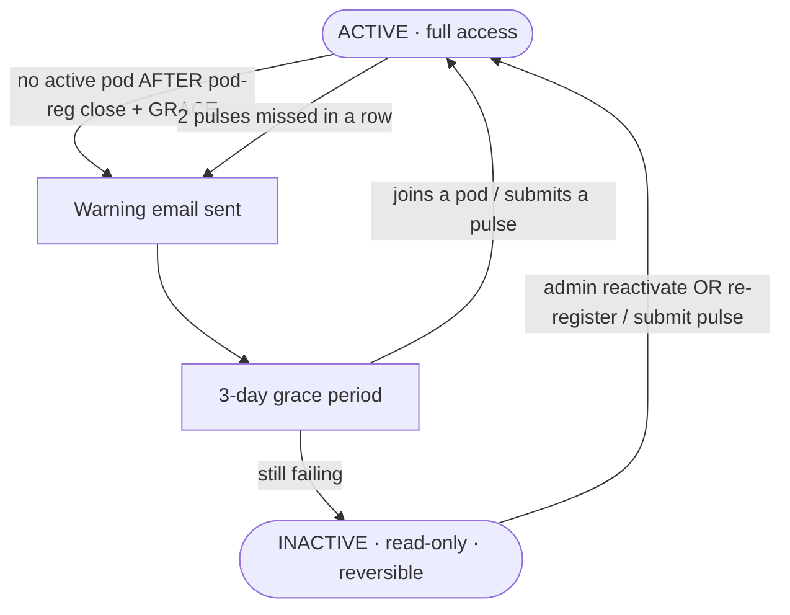

# 02 · Lock-out & safeguards

*How someone becomes "inactive," and the protections on that path.*

## The state machine

## What "inactive" means

"Inactive" is **read-only access for that cycle — not removal, and always reversible.** It exists so
the team can focus on people who are actually engaged. The two triggers come straight from the
program rules:

- You're in **no active pod** (after pod registration has closed), or
- You **missed two pulse checks in a row**.

## The safeguards on this path

Each maps to a decision in [04-decision-board.md](04-decision-board.md):

- 🛡️ **Grace window before "no pod" counts** (#123) — being slow on a form ≠ being disengaged.
- 🛡️ **Warning email + 3-day grace** before anyone goes inactive *(already built into the code)*.
- 🛡️ **Report-only mode + admin preview** — an admin can see *"who would be warned or revoked
  tonight"* **before** the system acts on anyone.
- 🛡️ **Admins and owners are exempt**, and a dedicated **test cycle is excluded entirely** (#122),
  so testing never touches real participants.
- 🛡️ **Always reversible** — an admin can reactivate, or the participant simply re-registers for a
  pod or submits a pulse and the next run flips them back to active.

## Why this matters

In May, none of the first three safeguards existed and the job acted immediately. The rewrite adds
all of them. The remaining decision is *how cautiously* we switch it back on — see
[03-may-incident.md](03-may-incident.md) and [04-decision-board.md](04-decision-board.md).
